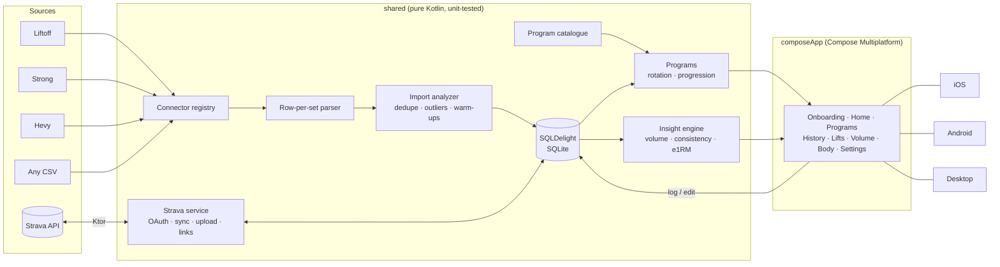

<h1 align="center">
  <br>
  Gains
</h1>

<p align="center"><strong>Know what's actually moving.</strong></p>

<p align="center">
  A training log that imports your history from Liftoff, Strong, Hevy or any workout CSV,<br>
  syncs both ways with Strava, and tells you which lifts are climbing, which have stalled and which are slipping.
</p>

<p align="center">
  <a href="https://github.com/gerra/gains/actions/workflows/ci.yml"></a>
  <a href="https://github.com/gerra/gains/actions/workflows/testflight.yml"></a>
  
  
  
  
</p>

<p align="center">
  <a href="#features">Features</a> ·
  <a href="#screenshots">Screenshots</a> ·
  <a href="#getting-started">Getting started</a> ·
  <a href="#testflight">TestFlight</a> ·
  <a href="#importing-your-history">Importing</a> ·
  <a href="#insights">Insights</a> ·
  <a href="#architecture">Architecture</a> ·
  <a href="#contributing">Contributing</a>
</p>

<p align="center">
  &nbsp;
  &nbsp;
  
</p>

---

## Why Gains

Most training apps are good at recording sets and bad at answering the only question that
matters weeks later: *is this working?* Gains keeps your whole history, including the years
you logged elsewhere, and turns it into a handful of plain statements: bench is up 6%, deadlift
has been stuck at the same top weight for seven weeks, you have not trained rear delts this
month. Every statement comes with the numbers and the chart behind it.

It is a [Kotlin Multiplatform](https://kotlinlang.org/docs/multiplatform.html) app with a
[Compose Multiplatform](https://www.jetbrains.com/compose-multiplatform/) UI. iOS is the primary
target; Android and a desktop (JVM) build share the same code. Everything lives in a local
SQLite database on the device. The only thing that talks to the network is the optional
[Strava sync](#strava), straight to Strava with your own API credentials; a self-hosted sync
server is planned.

<details>
<summary><strong>Table of contents</strong></summary>

- [Why Gains](#why-gains)
- [Features](#features)
- [Screenshots](#screenshots)
- [Getting started](#getting-started)
  - [Desktop](#desktop)
  - [Android](#android)
  - [iOS](#ios)
- [TestFlight](#testflight)
  - [Join the beta](#join-the-beta)
  - [Ship a build](#ship-a-build)
- [Importing your history](#importing-your-history)
  - [Supported exports](#supported-exports)
  - [What happens to a file](#what-happens-to-a-file)
- [Strava](#strava)
  - [Setting it up](#setting-it-up)
  - [What syncs](#what-syncs)
  - [How the sign-in comes back](#how-the-sign-in-comes-back)
- [Insights](#insights)
- [Architecture](#architecture)
- [Development](#development)
- [Roadmap](#roadmap)
- [Known limitations](#known-limitations)
- [Contributing](#contributing)
- [Acknowledgements](#acknowledgements)
- [License](#license)

</details>

## Features

- **A goal, then a program.** Three questions after sign-in (build muscle, get stronger, lose
  fat or general fitness; experience; days a week) rank the built-in programs by fit. Skip them
  and set the goal later in Settings. The goal also decides which insights lead on Home.
- **Programs with choosable days.** The r/Fitness Basic Beginner Routine, GZCLP, 5/3/1 for
  Beginners, Reddit PPL (6-day and 3-day), an Upper/Lower split and the r/bodyweightfitness
  Recommended Routine ship built in, each as named days of exercises with sets, reps and a
  progression rule. Days rotate on completion, never by weekday; Home shows the next one and any
  day can be started with a tap. Duplicate a built-in to edit it, or build your own.
- **Pre-filled workouts.** Starting a day opens the editor with every set loaded from your last
  session of that exercise and a hint such as `Last: 60 kg × 5,5,5 → try 62.5 kg` from the
  program's rule (linear, double progression or the GZCLP stage ladder).
- **Import from anywhere.** Drop in Liftoff, Strong or Hevy exports, or any CSV with date,
  exercise, weight and reps columns. The format is detected from the header, several files can
  be imported at once, and re-importing an overlapping export never creates duplicates.
- **Two-way Strava sync.** Connect your own Strava API application and every run, ride, swim or
  walk on Strava becomes a cardio session in History with distance and time. Workouts logged or
  imported here go the other way as Strava activities whose description lists every set. Links
  between sessions and activities keep both directions idempotent, so nothing is imported or
  uploaded twice and an uploaded workout never comes back down as a new session.
- **Honest insights.** Six rules, each a pure function with tunable thresholds, report
  progress, regressions, stalls, neglected lifts, neglected muscle groups and consistency.
  Nothing is reported without the sessions to back it up.
- **Per-lift analysis.** Estimated 1RM (Epley) over working sets, top set weight, volume per
  session and best set per session, over 3-month, 6-month, 1-year or all-time windows.
- **Weekly volume by muscle group.** Working sets per week with primary and secondary credit,
  flagged as maintenance under 8 sets and likely junk volume over 22.
- **Log and edit workouts.** Add sessions in the app, edit imported ones (date, duration,
  exercises, sets, notes) and have the edits flow into the same analyses.
- **Bodyweight tracking** with a 7-day average, and any lift overlaid on the trend.
- **A catalogue that understands names.** Nearly 300 built-in exercises with muscle
  contributions, equipment tags and aliases, so `Seated Dumbbell Shoulder Press` and
  `Seated Shoulder Press` are one lift. About 180 of them were curated from the public-domain
  [free-exercise-db](https://github.com/yuhonas/free-exercise-db). Unknown names become custom
  exercises you can merge later.
- **Careful with bad data.** Real RFC 4180 parsing, unit conversion and rounding, warm-up
  detection, timer-default holds flagged for review, corrupt durations dropped, empty rows
  listed with a reason.
- **Dark and light themes**, a floating pill navigation and animated Canvas charts with no
  charting library.
- **Local first.** Guest mode keeps everything on the device. The only network traffic is the
  Strava sync you set up yourself, straight to Strava with your own API credentials. Sign-in and
  the sync server light up only once a server exists.

## Screenshots

Every image is rendered from the real app by [a headless UI test](composeApp/src/desktopTest/kotlin/app/gains/ScreenshotTest.kt)
that signs in, imports the [sample export](samples/liftoff-export.csv) and walks through each
tab, so the pictures cannot drift from the code.

<table>
  <tr>
    <td align="center"><br><sub>Welcome</sub></td>
    <td align="center"><br><sub>Import preview</sub></td>
    <td align="center"><br><sub>Home: what's moving</sub></td>
    <td align="center"><br><sub>History and heat-map</sub></td>
  </tr>
  <tr>
    <td align="center"><br><sub>Lifts with sparklines</sub></td>
    <td align="center"><br><sub>Lift detail</sub></td>
    <td align="center"><br><sub>Weekly volume</sub></td>
    <td align="center"><br><sub>Bodyweight</sub></td>
  </tr>
  <tr>
    <td align="center"><br><sub>Settings</sub></td>
    <td align="center"><br><sub>Light theme</sub></td>
    <td align="center"><br><sub>Lift detail, light</sub></td>
    <td></td>
  </tr>
</table>

## Getting started

Requirements: JDK 17 or newer. Android additionally needs Android Studio with SDK 35, iOS needs
Xcode 15 or newer on a Mac.

```bash
git clone https://github.com/gerra/gains.git
cd gains
```

### Desktop

The desktop build is the quickest way to try the app or work on it. It has no dependency on the
Android SDK when you pass `-Pgains.android=false`.

```bash
# run the app
./gradlew :composeApp:run -Pgains.android=false

# open straight into the import preview with the bundled sample export
./gradlew :composeApp:run -Pgains.android=false -Pgains.openFile=samples/liftoff-export.csv

# run the tests
./gradlew :shared:desktopTest -Pgains.android=false
```

Pick **Continue as guest** on first launch, then import a file with the **+** button or log a
workout from the Home tab. The database lives in `~/.gains/gains.db`.

### Android

Open the project in Android Studio and run the `composeApp` configuration, or build an APK:

```bash
./gradlew :composeApp:assembleDebug
```

The app registers as a handler for CSV files, so exports shared from other apps open directly in
the import preview. Several files can be shared at once.

### iOS

```bash
open iosApp/iosApp.xcodeproj
```

Pick a device or simulator and run. The signing team, bundle id, version and build number live
in `iosApp/Configuration/Config.xcconfig`; change `TEAM_ID` there to build under another team.
The *Compile Kotlin Framework* phase runs Gradle with `-Pgains.android=false`, so a Mac needs a
JDK but no Android SDK. The Xcode project wraps the `ComposeApp` framework in SwiftUI and
registers the app as a CSV handler, so **Open in Gains** appears in the share sheet.

To put a build on a phone without a Mac and a cable, see [TestFlight](#testflight).

## TestFlight

Gains reaches iPhones and iPads through [TestFlight](https://developer.apple.com/testflight/).
Builds are signed by the team in `iosApp/Configuration/Config.xcconfig` and uploaded from Xcode
or by the [TestFlight workflow](.github/workflows/testflight.yml). The full checklist, the
one-time App Store Connect setup, the workflow secrets and troubleshooting are in
[docs/testflight.md](docs/testflight.md).

### Join the beta

1. Install [TestFlight](https://apps.apple.com/app/testflight/id899247664) from the App Store
   (iOS 16 or later).
2. Open the invite link on that device: **https://testflight.apple.com/join/XXXXXXXX**
   <!-- Replace XXXXXXXX with the public link from App Store Connect > TestFlight > the external group. -->
3. Tap **Accept**, then **Install**. TestFlight offers each new build as an update, and a build
   expires 90 days after it was uploaded.

The beta is the same local-first app as the source here: nothing leaves the device unless you
connect Strava. Report
problems with **Send Beta Feedback** in TestFlight (a screenshot from the app opens it) or in
the [issue tracker](https://github.com/gerra/gains/issues).

### Ship a build

**From Xcode.** Bump `CURRENT_PROJECT_VERSION` in `Config.xcconfig`, choose the
**Any iOS Device (arm64)** destination, run **Product > Archive**, then in the Organizer press
**Distribute App > TestFlight & App Store**.

**From GitHub Actions.** Add the six secrets listed in [docs/testflight.md](docs/testflight.md#upload-from-github-actions)
(distribution certificate, App Store profile, App Store Connect API key), then start the
**TestFlight** workflow from the Actions tab or push a `v*` tag. The run number becomes the
build number.

Either way the build shows up under **TestFlight** in App Store Connect after a few minutes of
processing, ready to be added to a tester group. Export compliance, the privacy manifest and an
alpha-free app icon are already handled in the project, so an upload needs no extra answers.

## Importing your history

### Supported exports

Every source implements `ImportConnector`: it recognises a file by its header and turns the rows
into sessions. The registry auto-detects the format, so you only ever pick files.

| Connector | Detects | Notes |
|-----------|---------|-------|
| **Liftoff** | The fixed Liftoff column order | Weights in lbs at float precision, `01 hours 00 minutes 00 seconds` durations. |
| **Strong** | `Workout Notes` or `Weight Unit` columns | Old and new export layouts, per-row weight and distance units, `1h 5m` durations. |
| **Hevy** | `exercise_title` and `start_time` | `weight_kg` / `weight_lbs` columns, `5 Jan 2026, 18:30` timestamps, duration from start and end times. |
| **Workout CSV** | Any date, exercise, weight and reps columns under common names | The fallback for spreadsheets and other apps. You choose the weight unit in the preview. |

Adding a connector is a `ColumnSpec` plus a `match` function; parsing, duplicate detection and
outlier handling are shared. Sessions remember their connector in the `source` column, and
workouts logged in the app carry `manual`.

### What happens to a file

Nothing is written until you confirm the preview. Along the way:

1. The file is read with an RFC 4180 parser, so quoted notes with commas and line breaks are fine.
2. Rows are grouped into sessions by timestamp and sorted. File order is never trusted.
3. Weights are converted to kg and rounded to 0.25 kg (`132.277357311 lbs` becomes `60 kg`).
   Files that do not state a unit get a unit picker in the preview.
4. Each set is classified as weighted, bodyweight, isometric or cardio. Empty rows are discarded
   and listed with the reason. Durations over four hours are dropped as timer errors.
5. Exercise names are mapped onto the catalogue through aliases. Unknown names become custom
   exercises with guessed muscle groups. You can merge them into a catalogue exercise in
   Settings, which records an alias for future imports.
6. A session is a calendar day: blocks logged at different times on one day are merged, exact
   copies are dropped, the same day across several files is kept once, and a stored session
   that matches on date, exercises and set count is recognised rather than duplicated.
7. Isometric holds more than five times the usual hold for that exercise are flagged. You decide
   per hold whether to keep or discard them.
8. Warm-ups are inferred per exercise per session: weighted sets under 85% of the session's top
   weight. The percentage can be overridden per lift.
9. Re-importing an overlapping export is safe: stored sessions are skipped, changed ones are
   replaced, new ones are added.

<details>
<summary>Importing several files at once</summary>

Multi-select in the Files picker, Android's document picker or the desktop dialog; the share
sheet accepts several files too. Files are parsed independently, a session that appears in more
than one file is stored once (the copy with more sets wins), and the merged set is then
de-duplicated against itself and the database exactly as a single file would be.

</details>

## Strava

Gains talks to Strava directly with the [Strava API v3](https://developers.strava.com/docs/reference/),
using an API application you create under your own account. There is no Gains server in between:
the credentials, the tokens and the links between sessions and activities all live in the local
database, and the tokens are refreshed by the app when they expire.

### Setting it up

1. Open **https://www.strava.com/settings/api** and create an application. Any name and website
   will do; set **Authorization Callback Domain** to `localhost`. Strava shows a **Client ID** and
   a **Client Secret**.
2. In Gains open **Settings › Strava › Connect**, paste both values and tap **Connect Strava**.
3. Strava asks you to allow Gains to *view data about your activities* (including private ones)
   and *upload your activities*. Both are needed for a two-way sync; if you untick one, the
   screen tells you which direction is off.
4. The first sync runs on its own after connecting and pulls your whole activity history. Later
   syncs are started with **Sync now** and only ask Strava for activities from the last sync
   onwards, with a 30-day margin so activities that reached Strava late are not missed.

A developer can instead bake the credentials into the build by filling in `StravaConfig` in
[`SharedModule.kt`](shared/src/commonMain/kotlin/app/gains/di/SharedModule.kt); values entered in
the app always win over those.

### What syncs

| Direction | What | Details |
|-----------|------|---------|
| **Strava → Gains** | Runs, rides, swims, walks, hikes, rowing, elliptical, stair stepper, skating, HIIT and every other sport type | One session per activity with one cardio set: moving time and distance, the activity name, elevation gain and average heart rate as the note, elapsed time as the duration. Ride variants (gravel, MTB, e-bike, virtual) become **Cycling**, run variants **Running**, unknown sports a custom cardio exercise named after the sport. |
| **Strava → Gains, skipped** | `WeightTraining` and `Workout` activities | Gym sessions on Strava carry no sets to analyse, and Gains' own uploads are of this type. The sync report says how many were left out. |
| **Gains → Strava** | Any session not from Strava: logged, imported from a CSV or started from a program day | A manual **Weight Training** activity named after the program day (or *Workout*) whose description lists every exercise and set, e.g. `Bench Press: 60 kg × 5, 5, 5 · 62.5 kg × 3`. A session that is a single cardio exercise goes up as that sport (Run, Ride, Swim, …) with its distance and time. Missing durations are estimated at three minutes a set. |

Sessions and activities are tied together in the `strava_link` table. A linked activity is never
imported again and a linked session is never uploaded again, which is what stops an uploaded
workout from coming back as a duplicate on the next sync. Deleting a downloaded session in Gains
keeps its link, so it stays deleted; **Delete all imported sessions** in Settings clears the
links too, so the following sync starts from scratch. Edits to a downloaded session stay in
Gains; nothing is ever changed or deleted on Strava.

Uploads happen one at a time from the Strava screen (**Upload all**, oldest first, with a
progress count) or from a workout's editor (**Upload**). Strava allows roughly a hundred uploads
every fifteen minutes; when the limit is hit the bulk upload stops with a message and the rest
waits for the next round. Disconnecting revokes Gains' access on Strava and forgets the tokens;
imported sessions and links are kept.

### How the sign-in comes back

Strava's OAuth flow ends with a redirect to a URL under the callback domain. Each platform supplies
an `OAuthLauncher` that opens the consent page and gets that URL back into the app through
`IncomingLinks`:

- **Desktop** starts a one-shot HTTP server on a random `127.0.0.1` port (Strava whitelists
  loopback hosts), opens the system browser and stops the server after the redirect. If no browser
  opens, the screen shows the link to copy.
- **iOS** uses `ASWebAuthenticationSession` with the `gains://localhost/strava` callback; the same
  scheme is registered in `Info.plist` so a redirect coming from the Strava app arrives too.
- **Android** opens the browser with `ACTION_VIEW` and receives `gains://localhost/strava` through
  an intent filter on `MainActivity`; the manifest also declares the `INTERNET` permission.

The exchange itself (code → tokens, refresh, listing, creating) is `StravaApi` over Ktor with the
platform's engine (CIO, OkHttp, Darwin); `StravaService` owns the state check, token refresh, the
download and upload passes and the link bookkeeping. Every piece is unit-tested against a
scripted Strava with Ktor's `MockEngine`.

## Insights

Insight rules are pure functions in [`InsightEngine.kt`](shared/src/commonMain/kotlin/app/gains/analysis/InsightEngine.kt)
with their thresholds gathered in `InsightThresholds`. The defaults:

| Insight | Rule |
|---------|------|
| **Progress** | Best performance in the last 30 days beats the earlier all-time best by at least 2.5%. |
| **Regression** | Best performance in the last 30 days is at least 5% below the all-time best before that window. Weighted lifts compare Epley e1RM, bodyweight lifts reps, holds seconds, cardio distance. |
| **Stall** | Top working weight unchanged for 6+ weeks with at least 4 sessions in that time, and the lift was trained in the last 4 weeks. Not reported when a regression already is. |
| **Neglected lift** | Trained 4+ times in a 12-week span, then absent for 4+ weeks. |
| **Neglected muscle** | Averaged 8+ working sets a week over the previous 8 weeks, now under 4 a week over the last 2. |
| **Consistency** | Sessions per week over the last 4 weeks against the 4 before. Within 15% counts as steady. |

Volume credits 1.0 set to primary muscle groups and 0.5 to secondary ones across 17 groups.

## Architecture



| Module | Contents |
|--------|----------|
| [`shared/`](shared) | Import connectors over a shared row-per-set parser, domain model, exercise and program catalogues, import analyzer, SQLDelight persistence, insight engine, program rotation and progression logic, and the Strava client and sync service (Ktor + kotlinx.serialization). Pure Kotlin, no UI, 125+ unit tests including an in-memory SQLite integration test, a schema migration test, a 10,000-row import timing test and a scripted Strava round trip. |
| [`composeApp/`](composeApp) | Compose Multiplatform UI (goal onboarding, home insights with the next program day, programs and a program editor, history with a workout editor, import preview, Strava, lifts, volume, bodyweight, settings), Canvas charts and the Android, iOS and desktop entry points with their OAuth launchers. |
| [`iosApp/`](iosApp) | Xcode project wrapping the `ComposeApp` framework in SwiftUI. |
| [`samples/`](samples) | A generated eight-month Liftoff export used by the screenshots and handy for trying the app. |

Dependencies are wired with [Koin](https://insert-koin.io/); each platform supplies a
`DatabaseDriverFactory` and everything else comes from `SharedModule`. Screens use a small
`ScreenModel` state holder over Kotlin Flows.

### Accounts and sync

On first launch the app asks how to continue. **Continue as guest** keeps everything in the local
database. **Continue with Google / Apple** are present but disabled: they light up once
`AuthConfig` in [`Account.kt`](shared/src/commonMain/kotlin/app/gains/auth/Account.kt) carries a
Google client id, an Apple service id and the sync server's base URL. Settings shows the current
account and lets you return to the sign-in screen; local data is kept.

## Development

```bash
./gradlew :shared:desktopTest -Pgains.android=false            # parser, importer, insight and integration tests
./gradlew :composeApp:desktopTest -Pgains.android=false        # UI smoke test that also renders screenshots into composeApp/build/screenshots
./gradlew :composeApp:run -Pgains.android=false                # desktop app
```

`-Pgains.android=false` configures the build without the Android Gradle Plugin, which is what
CI does on runners without an SDK. Everything else is unaffected.

**Screenshots.** The [Screenshots workflow](.github/workflows/screenshots.yml) runs the UI test on
a GitHub runner and commits the images under `docs/screenshots`. Trigger it from the Actions tab
after a UI change.

**Releasing.** The [TestFlight workflow](.github/workflows/testflight.yml) archives the iOS app
on a macOS runner and uploads it to App Store Connect. [docs/testflight.md](docs/testflight.md)
covers the secrets it needs and the manual route through Xcode.

**Adding a connector.** Declare a `ColumnSpec` and a `match` function in
[`CsvConnectors.kt`](shared/src/commonMain/kotlin/app/gains/connectors/CsvConnectors.kt), register
it in `Connectors`, and add a fixture to `ConnectorsTest`.

**Tuning an insight.** Change the defaults in `InsightThresholds` and adjust the corresponding
case in `InsightEngineTest`. Per-goal overrides live in `GoalTuning`.

**Adding a built-in program.** Add a `program { day { slot(...) } }` block to
[`ProgramCatalogue.kt`](shared/src/commonMain/kotlin/app/gains/catalogue/ProgramCatalogue.kt);
`ProgramCatalogueTest` checks that every slot points at a catalogue exercise. Progression rules
are `linear`, `double` (reps climb, then weight) or `ladder` (GZCLP-style stages).

**Changing the schema.** Edit the `.sq` file and add a `migrations/N.sqm` with the same DDL;
`MigrationTest` upgrades a database from the previous version and compares it with a fresh one.

## Roadmap

- [x] Strava: two-way sync of activities and workouts
- [ ] Self-hosted sync server (the token exchange in `AccountRepository` is the open TODO)
- [ ] Google and Apple sign-in, which the server unlocks
- [ ] More connectors: a `ColumnSpec` and a `match` function each, contributions welcome

## Known limitations

- The Android source set is written against the standard APIs but is not compiled in CI, which
  runs without an Android SDK. Open the project in Android Studio to build it.
- The iOS app compiles to Kotlin/Native klibs on any host, but linking, running and archiving
  it needs Xcode on a Mac (the TestFlight workflow uses a hosted macOS runner for this).
- Sign-in buttons are placeholders until the sync server exists.

## Contributing

Issues and pull requests are welcome. Keep the shared module free of platform code, add a test
for anything the parser or an insight rule should handle, and run the desktop tests before
opening a PR.

## Acknowledgements

- [Compose Multiplatform](https://www.jetbrains.com/compose-multiplatform/) for the UI
- [SQLDelight](https://sqldelight.github.io/sqldelight/) for typed SQLite
- [Koin](https://insert-koin.io/) for dependency injection
- [kotlinx-datetime](https://github.com/Kotlin/kotlinx-datetime) for dates without tears
- The README layout borrows from the projects collected in [awesome-readme](https://github.com/matiassingers/awesome-readme)

## License

No license has been chosen yet, so all rights are reserved by the author until one is added.
