<h1 align="center">
  <br>
  Gains
</h1>

<p align="center"><strong>Know what's actually moving.</strong></p>

<p align="center">
  A training log that imports your history from Liftoff, Strong, Hevy or any workout CSV<br>
  and tells you which lifts are climbing, which have stalled and which are slipping.
</p>

<p align="center">
  <a href="https://github.com/gerra/gains/actions/workflows/ci.yml"></a>
  <a href="https://github.com/gerra/gains/releases/latest"></a>
  
  
  
  
</p>

<p align="center">
  <a href="#features">Features</a> ·
  <a href="#screenshots">Screenshots</a> ·
  <a href="#getting-started">Getting started</a> ·
  <a href="#testflight">TestFlight</a> ·
  <a href="#importing-your-history">Importing</a> ·
  <a href="#insights">Insights</a> ·
  <a href="#streaks-and-the-nudge">Streaks</a> ·
  <a href="#architecture">Architecture</a> ·
  <a href="#contributing">Contributing</a>
</p>

<p align="center">
  &nbsp;
  &nbsp;
  
</p>

---

## Why Gains

Most training apps are good at recording sets and bad at answering the only question that
matters weeks later: *is this working?* Gains keeps your whole history, including the years
you logged elsewhere, and turns it into a handful of plain statements: bench is up 6%, deadlift
has been stuck at the same top weight for seven weeks, you have not trained rear delts this
month. Every statement comes with the numbers and the chart behind it.

It is a [Kotlin Multiplatform](https://kotlinlang.org/docs/multiplatform.html) app with a
[Compose Multiplatform](https://www.jetbrains.com/compose-multiplatform/) UI. iOS is the primary
target; Android and a desktop (JVM) build share the same code. Everything lives in a local
SQLite database on the device. Signing in (Sign in with Apple on iOS today) adds a self-hosted
sync server that carries it between your devices; as a guest, nothing leaves the device.

<details>
<summary><strong>Table of contents</strong></summary>

- [Why Gains](#why-gains)
- [Features](#features)
- [Screenshots](#screenshots)
- [Getting started](#getting-started)
  - [Desktop](#desktop)
  - [Android](#android)
  - [iOS](#ios)
- [TestFlight](#testflight)
  - [Join the beta](#join-the-beta)
  - [Ship a build](#ship-a-build)
- [Importing your history](#importing-your-history)
  - [Supported exports](#supported-exports)
  - [What happens to a file](#what-happens-to-a-file)
- [Insights](#insights)
- [Streaks and the nudge](#streaks-and-the-nudge)
- [Architecture](#architecture)
  - [Accounts and sync](#accounts-and-sync)
- [Development](#development)
  - [Languages](#languages)
- [Roadmap](#roadmap)
- [Known limitations](#known-limitations)
- [Contributing](#contributing)
- [Acknowledgements](#acknowledgements)
- [License](#license)

</details>

## Features

- **A goal, then a program.** Three questions after sign-in (build muscle, get stronger, lose
  fat or general fitness; experience; days a week) rank the built-in programs by fit. Skip them
  and set the goal later in Settings. The goal also decides which insights lead on Home.
- **Programs with choosable days.** The r/Fitness Basic Beginner Routine, GZCLP, 5/3/1 for
  Beginners, Reddit PPL (6-day and 3-day), an Upper/Lower split and the r/bodyweightfitness
  Recommended Routine ship built in, each as named days of exercises with sets, reps and a
  progression rule. Days rotate on completion, never by weekday; Home shows the next one with
  the rotation order, and the program page lays out a full cycle week by week, every day's
  exercises and how each lift progresses. Any day can be started with a tap. Duplicate a
  built-in to edit it, or build your own.
- **Pre-filled workouts.** Starting a day opens the editor with every set loaded from your last
  session of that exercise and a hint such as `Last: 60 kg × 5,5,5 → try 62.5 kg` from the
  program's rule (linear, double progression or the GZCLP stage ladder). The first session of a
  GZCLP tier is estimated rather than copied: the best recent free-session set gives an Epley
  1RM, T1 starts at 85% of it, T2 at 65% and T3 at about 52%, rounded down to the plates and
  never at a weight you already failed for the tier's reps (`Last: 50 kg × 6,8,9 → est. 1RM
  ~65 kg → T2 start 40 kg`). Once a tier has its own sessions, its ladder takes over.
  Whatever the workout, every set row carries a `PREV` column with the same-numbered set of the
  exercise's last session (`60×5`), so each set can be judged against last time while it is typed.
- **Warm-ups and rest.** Tiered days pre-fill warm-up sets (T1: empty bar, 40/60/80%; T2: bar
  and 60%; T3: one light set on cables and machines), labelled `W1, W2…` so the work sets stay
  1–5. They are stored as warm-ups and never count towards volume, records or progression, can
  be hidden or removed per exercise, and can be switched off in Settings along with the bar
  weight. Each tier shows its rest (T1 3–5 min, T2 2–3 min, T3 60–90 s).
- **Tick sets off as you go.** Every set row ends in a Liftoff-style check: tap it when the set is
  done to mark the row and start the rest timer, tap again to undo. An empty row can't be ticked.
  If you save with some work sets ticked and others left unticked, you're asked whether to leave
  the unticked ones out; a workout where nothing was ticked saves every set as before.
- **Timed sessions.** Opening a program day (or **Start workout** from the **+** menu) shows the
  plan ready to go, every set shown disabled; nothing runs and nothing can be changed until you
  press **Start**. From then the workout is against the clock: a bar pinned above the sets shows the total time and the rest left, and ticking a set
  restarts the countdown. The workout is written to the database as you go, so it survives the
  app being killed; leave it and a bar above the tabs shows it ticking with a tap to resume.
  **End session** asks about unticked sets the same way, stores the workout with the timed
  duration, and past three hours asks whether the timer was left running before it does.
  While it runs, the workout is a tap away from anywhere. On Android an ongoing notification in
  the tray shows the total time counting up and, during a rest, the countdown beside it with a
  **Skip rest** button; both clocks are kept by the system, so they run on while the app is
  asleep. On iOS a notification goes up in Notification Centre whenever the app is left, with the
  start time and how long the workout has run, and a rest becomes a scheduled **Rest over**
  notification that iOS delivers when the countdown ends. The desktop has a tray icon with the
  same **Skip rest** in its menu. Each is cleared when the session is ended or discarded.
  **Log past workout** still logs a session by date, time and duration.
- **A summary when you finish.** Ending a session opens what it came to: how long it took, on the
  wheels in case the clock was wrong; your last body weight filled in, ready to be recorded against
  the day; a caption with a photo beside it to remember it by; and then the muscle groups it trained,
  shaded onto the body with their set counts. What there is to fill in comes first, what the workout
  came to after. Everything there edits the workout already stored, so leaving at any point keeps it. The photo is shrunk to a long side of 1280 px and kept in the database beside the
  session, on the device like everything else; the caption and a photo marker show on the workout in
  History, and the summary reopens from the workout's editor.
- **Nothing to type but reps.** Weights are picked on a wheel (whole units and quarters, with
  plate-jump buttons for the usual step between sets), the date on a calendar, the time and the
  duration on hour-and-minute wheels, so there is no format to get wrong and no keyboard to put
  away mid-set.
- **Import from anywhere.** Drop in Liftoff, Strong or Hevy exports, or any CSV with date,
  exercise, weight and reps columns. The format is detected from the header, several files can
  be imported at once, and re-importing an overlapping export never creates duplicates.
- **Honest insights.** Six rules, each a pure function with tunable thresholds, report
  progress, regressions, stalls, neglected lifts, neglected muscle groups and consistency.
  Nothing is reported without the sessions to back it up.
- **A week streak that survives a rest week.** The streak counts consecutive *weeks* with at least
  one session, not days — a training log that asked for a session every day would be asking for
  something no program wants. Home leads with it: the number, the week Monday to Sunday with the
  days trained filled and today ringed, your sessions against your own days-a-week target, and one
  plain sentence about what is actually at stake. Every four weeks kept banks a **rest week**, two
  at most; a missed week spends one instead of ending the run, silently, and the calendar shows it
  afterwards. Miss a whole week with none banked and the run ends — there is no way to buy it back.
  Nothing on the card moves except the ring around today, and only on the two days it means
  something. See [Streaks and the nudge](#streaks-and-the-nudge).
- **Per-lift analysis.** Estimated 1RM (Epley) over working sets, top set weight, volume per
  session and best set per session, over 3-month, 6-month, 1-year or all-time windows.
- **Weekly volume by muscle group.** Working sets per week with primary and secondary credit,
  flagged as maintenance under 8 sets and likely junk volume over 22. The sets are also shaded
  onto a body, front and back; tap a muscle to see its numbers and filter the list to it.
- **Log and edit workouts.** Add sessions in the app, edit imported ones (date, duration,
  exercises, sets, notes) and have the edits flow into the same analyses. Each exercise card
  has a menu to swap the lift for another while keeping every set typed so far, to move it up
  or down the workout, or to remove it. Program slots can be swapped the same way.
- **Bodyweight tracking** with a 7-day average, and any lift overlaid on the trend.
- **A catalogue that understands names.** Nearly 300 built-in exercises with muscle
  contributions, equipment tags and aliases, so `Seated Dumbbell Shoulder Press` and
  `Seated Shoulder Press` are one lift. About 180 of them were curated from the public-domain
  [free-exercise-db](https://github.com/yuhonas/free-exercise-db). Unknown names become custom
  exercises you can merge later.
- **How to do it.** Every built-in exercise but a handful has its start and end position from
  free-exercise-db, cross-faded into a loop on the lift's page and under **How to do it** in an
  exercise card's menu while you train; tap the picture to freeze it. The photos ship inside the
  app, so they work in a basement gym with no signal. Every exercise, custom ones included, also
  has a **Watch a video** button that opens a YouTube search in the browser, the one place the
  app reaches outside itself, and only when you tap it.
- **Careful with bad data.** Real RFC 4180 parsing, unit conversion and rounding, warm-up
  detection, timer-default holds flagged for review, corrupt durations dropped, empty rows
  listed with a reason.
- **Dark and light themes**, a floating pill navigation and animated Canvas charts with no
  charting library.
- **Local first, sync optional.** Guest mode keeps everything on the device. Sign in with Apple on
  iOS syncs it through the self-hosted server at `api.gains.gerra.sh`; Google and the other
  platforms follow ([docs/auth-plan.md](docs/auth-plan.md)).
- **English and Russian.** Settings → Language switches between them where you stand, with no
  relaunch, and follows the device while it is left on System. Down to the insight sentences, the
  progression hints, the built-in programs and every exercise in the catalogue. See
  [Languages](#languages).

## Screenshots

Every image is rendered from the real app by [a headless UI test](composeApp/src/desktopTest/kotlin/app/gains/ScreenshotTest.kt)
that signs in, imports the [sample export](samples/liftoff-export.csv) and walks through each
tab, so the pictures cannot drift from the code.

<table>
  <tr>
    <td align="center"><br><sub>Welcome</sub></td>
    <td align="center"><br><sub>Import preview</sub></td>
    <td align="center"><br><sub>Home: what's moving</sub></td>
    <td align="center"><br><sub>History and heat-map</sub></td>
  </tr>
  <tr>
    <td align="center"><br><sub>Lifts with sparklines</sub></td>
    <td align="center"><br><sub>Lift detail</sub></td>
    <td align="center"><br><sub>Weekly volume on the body</sub></td>
    <td align="center">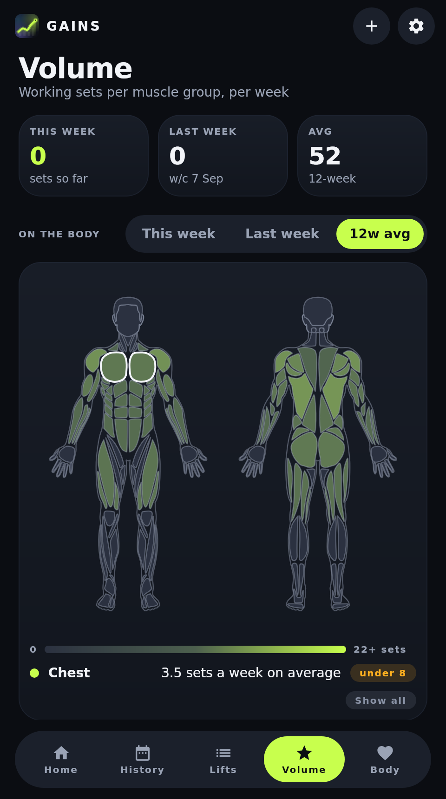<br><sub>Tap a muscle to filter</sub></td>
  </tr>
  <tr>
    <td align="center">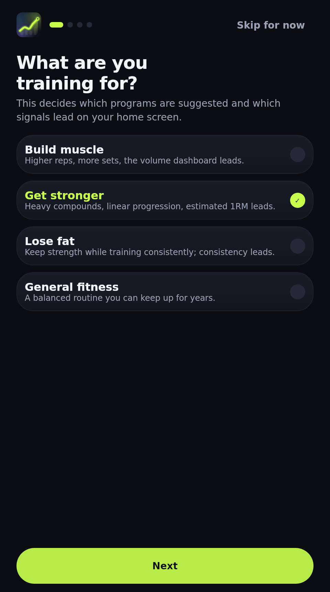<br><sub>Goal onboarding</sub></td>
    <td align="center">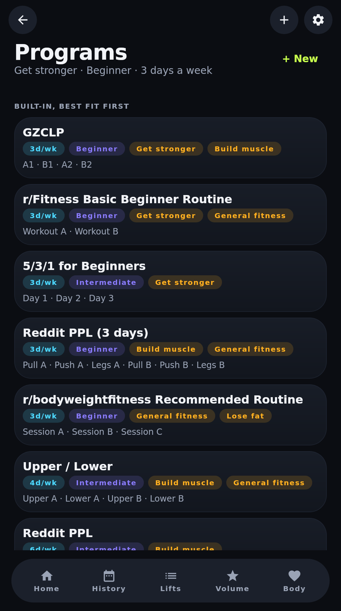<br><sub>Programs ranked by fit</sub></td>
    <td align="center">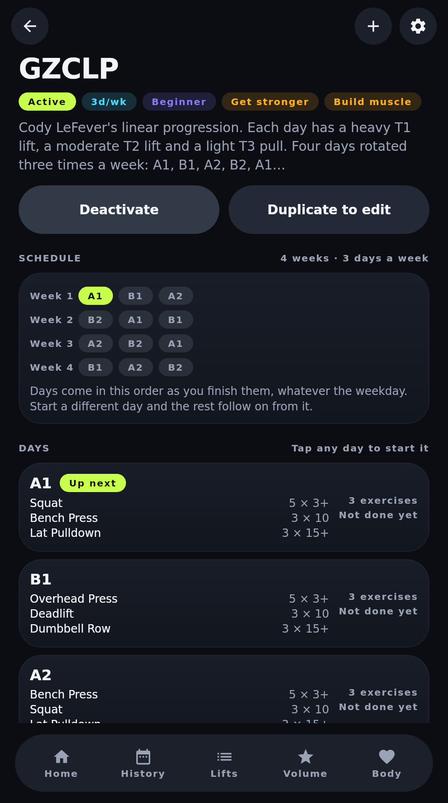<br><sub>A program, week by week</sub></td>
    <td align="center">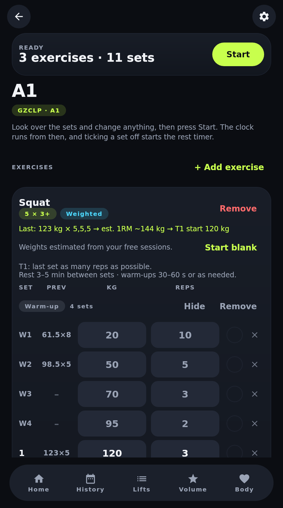<br><sub>A day, ready to start</sub></td>
  </tr>
  <tr>
    <td align="center">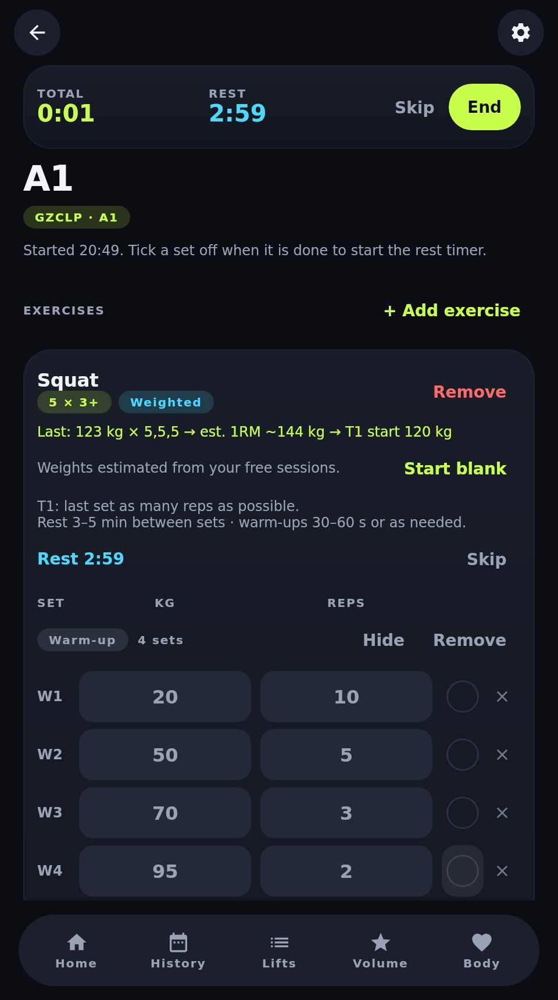<br><sub>Timed session and rest</sub></td>
    <td align="center">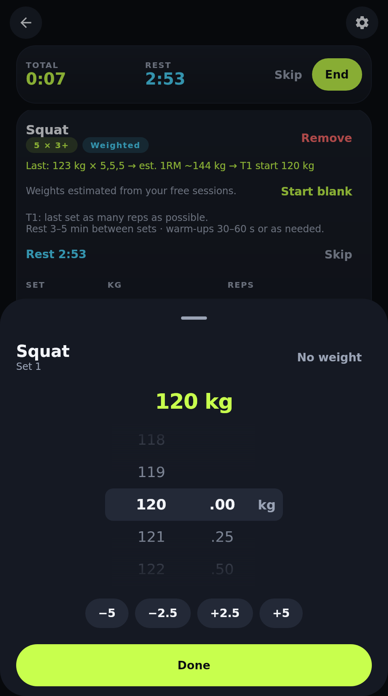<br><sub>Weights on a wheel</sub></td>
    <td align="center">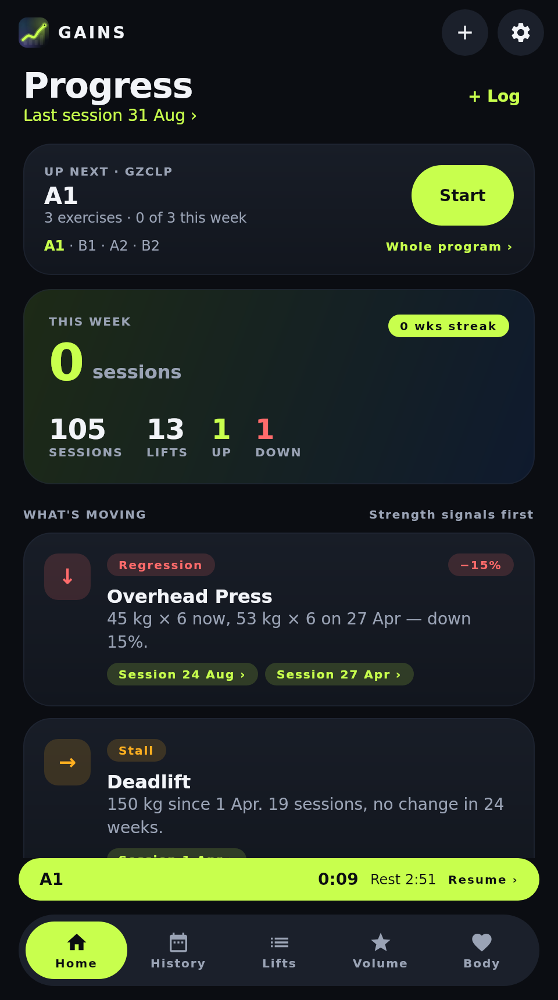<br><sub>Up next, and resume</sub></td>
    <td align="center">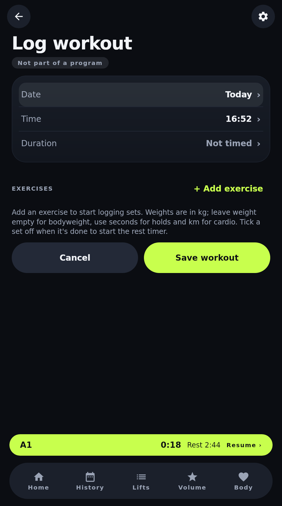<br><sub>Log a past workout</sub></td>
  </tr>
  <tr>
    <td align="center"><br><sub>Bodyweight</sub></td>
    <td align="center"><br><sub>Settings</sub></td>
    <td align="center">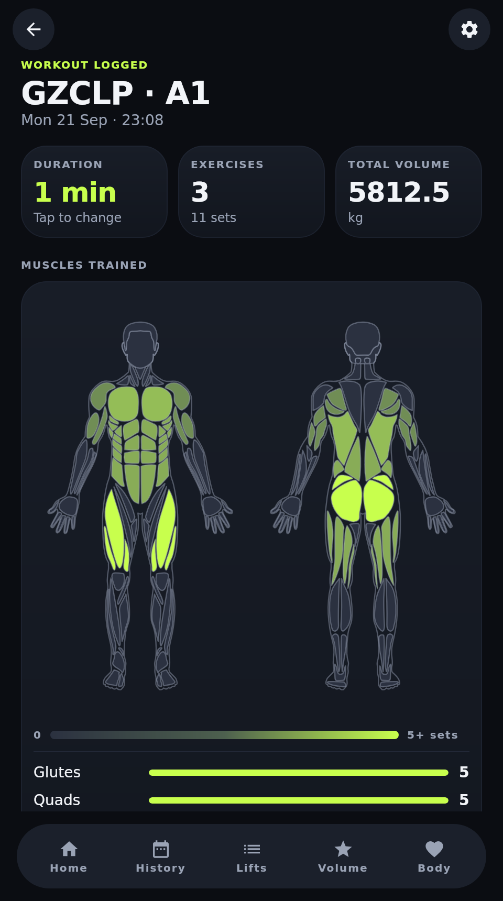<br><sub>Summary when you finish</sub></td>
    <td align="center">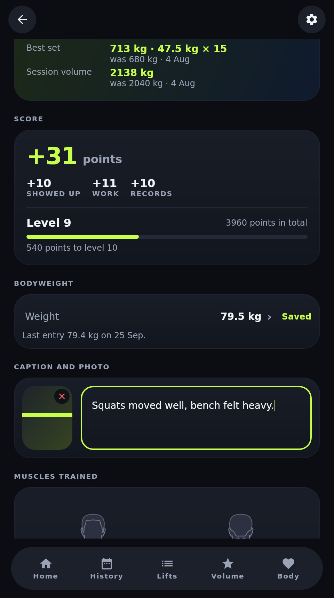<br><sub>Body weight, caption, photo</sub></td>
  </tr>
  <tr>
    <td align="center">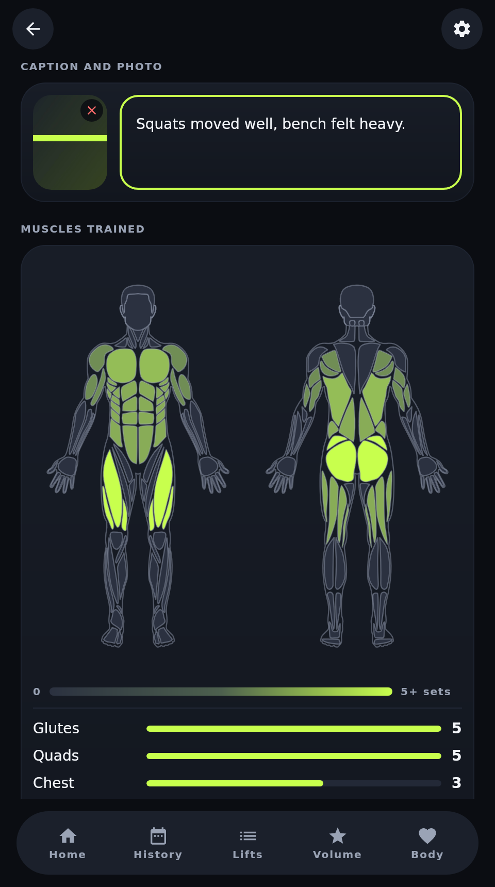<br><sub>What it trained</sub></td>
    <td align="center">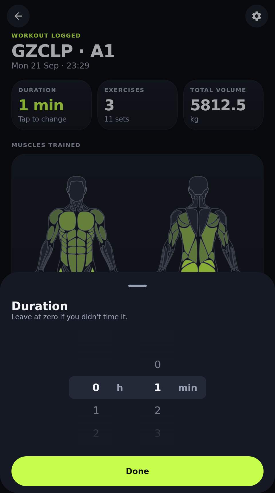<br><sub>Duration on the wheels</sub></td>
    <td align="center"><br><sub>Light theme</sub></td>
    <td align="center"><br><sub>Lift detail, light</sub></td>
  </tr>
</table>

The streak card has more states than a walk through the app can show, so it is rendered on its own
as well — at risk on the two days the nudge fires, what it says instead when a rest week would cover
the miss, a safe week, a full one, a week a rest week carried, and an empty slate.

<p align="center">
  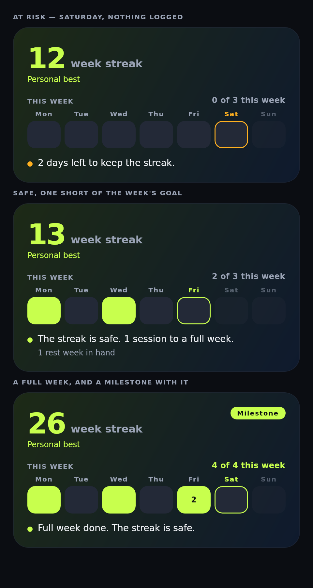
</p>

## Getting started

Requirements: JDK 17 or newer. Android additionally needs Android Studio with SDK 35, iOS needs
Xcode on a Mac (Xcode 26 to upload to App Store Connect, which only takes builds made with the
current iOS SDK).

```bash
git clone https://github.com/gerra/gains.git
cd gains
```

### Desktop

The desktop build is the quickest way to try the app or work on it. It has no dependency on the
Android SDK when you pass `-Pgains.android=false`.

```bash
# run the app
./gradlew :composeApp:run -Pgains.android=false

# open straight into the import preview with the bundled sample export
./gradlew :composeApp:run -Pgains.android=false -Pgains.openFile=samples/liftoff-export.csv

# run the tests
./gradlew :shared:desktopTest -Pgains.android=false
```

Pick **Continue as guest** on first launch, then import a file with the **+** button or log a
workout from the Home tab. The database lives in `~/.gains/gains.db`.

### Android

Open the project in Android Studio and run the `composeApp` configuration, or build an APK:

```bash
./gradlew :composeApp:assembleDebug
```

The app registers as a handler for CSV files, so exports shared from other apps open directly in
the import preview. Several files can be shared at once.

### iOS

```bash
open iosApp/iosApp.xcodeproj
```

Pick a device or simulator and run. The signing team, bundle id, version and build number live
in `iosApp/Configuration/Config.xcconfig`; change `TEAM_ID` there to build under another team.
The *Compile Kotlin Framework* phase runs Gradle with `-Pgains.android=false`, so a Mac needs a
JDK but no Android SDK. The Xcode project wraps the `ComposeApp` framework in SwiftUI and
registers the app as a CSV handler, so **Open in Gains** appears in the share sheet.

To put a build on a phone without a Mac and a cable, see [TestFlight](#testflight).

## TestFlight

Gains reaches iPhones and iPads through [TestFlight](https://developer.apple.com/testflight/).
The newest build is the [latest release](https://github.com/gerra/gains/releases/latest), with
what changed since the one before; every build is listed under
[Releases](https://github.com/gerra/gains/releases). Builds are signed by the team in
`iosApp/Configuration/Config.xcconfig` and uploaded from Xcode or by the
[TestFlight workflow](.github/workflows/testflight.yml). The full checklist, the
one-time App Store Connect setup, the workflow secrets and troubleshooting are in
[docs/testflight.md](docs/testflight.md).

### Join the beta

1. Install [TestFlight](https://apps.apple.com/app/testflight/id899247664) from the App Store
   (iOS 16 or later).
2. Open the invite link on that device: **https://testflight.apple.com/join/T4dqvPW7**
3. Tap **Accept**, then **Install**. TestFlight offers each build added to the public beta as
   an update, and a build expires 90 days after it was uploaded.

The beta is the same app as the source here. As a guest nothing leaves the device; Sign in with
Apple syncs your data to the Gains server so it follows you to another device. Report
problems with **Send Beta Feedback** in TestFlight (a screenshot from the app opens it) or in
the [issue tracker](https://github.com/gerra/gains/issues).

### Ship a build

**From Xcode.** Bump `CURRENT_PROJECT_VERSION` in `Config.xcconfig`, choose the
**Any iOS Device (arm64)** destination, run **Product > Archive**, then in the Organizer press
**Distribute App > TestFlight & App Store**.

**From GitHub Actions.** Add the six secrets listed in [docs/testflight.md](docs/testflight.md#upload-from-github-actions)
(distribution certificate, App Store profile, App Store Connect API key). Then, every two
hours through the day, a release branch `release/<major>.<minor>` is cut from `main` with the
minor bumped — on the even hours from 08:00 to 22:00 UTC — uploaded to TestFlight an hour
later, published as a [GitHub release](https://github.com/gerra/gains/releases) and offered
back to `main` as a pull request. Commits merged in between ride the next branch; a quiet
couple of hours ships nothing. A `v*` tag or **Run workflow** in the Actions
tab uploads by hand. The run number becomes the build number.
Details in [docs/testflight.md](docs/testflight.md#releases-through-the-day).

**From Xcode Cloud.** No Mac and no secrets: Apple's CI signs and uploads the build itself.
Connect the app once in App Store Connect and point the workflow's Archive action at
TestFlight; [`ci_scripts/ci_post_clone.sh`](iosApp/ci_scripts/ci_post_clone.sh) installs the
JDK the Kotlin build needs and keeps the Gradle and Kotlin/Native caches between builds. Details in [docs/testflight.md](docs/testflight.md#upload-from-xcode-cloud).

Either way the build shows up under **TestFlight** in App Store Connect after a few minutes of
processing, ready to be added to a tester group. Export compliance, the privacy manifest and an
alpha-free app icon are already handled in the project, so an upload needs no extra answers. The
privacy manifest and the App Privacy answers still describe a local-only app, though, and need
updating now that signed-in data leaves the device (item 7 in [docs/auth-plan.md](docs/auth-plan.md)).

## Importing your history

### Supported exports

Every source implements `ImportConnector`: it recognises a file by its header and turns the rows
into sessions. The registry auto-detects the format, so you only ever pick files.

| Connector | Detects | Notes |
|-----------|---------|-------|
| **Liftoff** | The fixed Liftoff column order | Weights in lbs at float precision, `01 hours 00 minutes 00 seconds` durations. |
| **Strong** | `Workout Notes` or `Weight Unit` columns | Old and new export layouts, per-row weight and distance units, `1h 5m` durations. |
| **Hevy** | `exercise_title` and `start_time` | `weight_kg` / `weight_lbs` columns, `5 Jan 2026, 18:30` timestamps, duration from start and end times. |
| **Workout CSV** | Any date, exercise, weight and reps columns under common names | The fallback for spreadsheets and other apps. You choose the weight unit in the preview. |

Adding a connector is a `ColumnSpec` plus a `match` function; parsing, duplicate detection and
outlier handling are shared. Sessions remember their connector in the `source` column, and
workouts logged in the app carry `manual`.

### What happens to a file

Nothing is written until you confirm the preview. Along the way:

1. The file is read with an RFC 4180 parser, so quoted notes with commas and line breaks are fine.
2. Rows are grouped into sessions by timestamp and sorted. File order is never trusted.
3. Weights are converted to kg and rounded to 0.25 kg (`132.277357311 lbs` becomes `60 kg`).
   Files that do not state a unit get a unit picker in the preview.
4. Each set is classified as weighted, bodyweight, isometric or cardio. Empty rows are discarded
   and listed with the reason. Durations over four hours are dropped as timer errors.
5. Exercise names are mapped onto the catalogue through aliases. Unknown names become custom
   exercises with guessed muscle groups. You can merge them into a catalogue exercise in
   Settings, which records an alias for future imports.
6. A session is a calendar day: blocks logged at different times on one day are merged, exact
   copies are dropped, the same day across several files is kept once, and a stored session
   that matches on date, exercises and set count is recognised rather than duplicated.
7. Isometric holds more than five times the usual hold for that exercise are flagged. You decide
   per hold whether to keep or discard them.
8. Warm-ups are inferred per exercise per session: weighted sets under 85% of the session's top
   weight. The percentage can be overridden per lift. Only warm-ups you marked (or a program day
   planned) are stored; inferred ones are recomputed on every read, so changing the percentage
   re-classifies old sessions.
9. Re-importing an overlapping export is safe: stored sessions are skipped, changed ones are
   replaced, new ones are added.

<details>
<summary>Importing several files at once</summary>

Multi-select in the Files picker, Android's document picker or the desktop dialog; the share
sheet accepts several files too. Files are parsed independently, a session that appears in more
than one file is stored once (the copy with more sets wins), and the merged set is then
de-duplicated against itself and the database exactly as a single file would be.

</details>

## Insights

Insight rules are pure functions in [`InsightEngine.kt`](shared/src/commonMain/kotlin/app/gains/analysis/InsightEngine.kt)
with their thresholds gathered in `InsightThresholds`. The defaults:

| Insight | Rule |
|---------|------|
| **Progress** | Best performance in the last 30 days beats the earlier all-time best by at least 2.5%. |
| **Regression** | Best performance in the last 30 days is at least 5% below the all-time best before that window. Weighted lifts compare Epley e1RM, bodyweight lifts reps, holds seconds, cardio distance. |
| **Stall** | Top working weight unchanged for 6+ weeks with at least 4 sessions in that time, and the lift was trained in the last 4 weeks. Not reported when a regression already is. |
| **Neglected lift** | Trained 4+ times in a 12-week span, then absent for 4+ weeks. |
| **Neglected muscle** | Averaged 8+ working sets a week over the previous 8 weeks, now under 4 a week over the last 2. |
| **Consistency** | Sessions per week over the last 4 weeks against the 4 before. Within 15% counts as steady. |

Volume credits 1.0 set to primary muscle groups and 0.5 to secondary ones across 17 groups.

The Volume tab draws working sets on a body, front and back
([`BodyMap.kt`](composeApp/src/commonMain/kotlin/app/gains/ui/charts/BodyMap.kt)): each muscle is
shaded from the resting body colour at zero sets to the full accent at 22, for this week, last week
or the average over the trend window (the most recent one with any sets is shown first), and tapping
a muscle shows its numbers and narrows the list below to it. The drawing is a set of SVG paths rendered on a Compose
`Canvas`, so it needs no platform code and taps are hit-tested against the paths themselves. The
drawing is coarser than the 17 groups in a few places: its one deltoid per view stands for front
and side delts on the front, rear and side delts on the back; abs and obliques together are core;
adductors and tibialis are drawn but not tracked.

## Streaks and the nudge

The whole streak is one forward pass over the session history in
[`StreakEngine.kt`](shared/src/commonMain/kotlin/app/gains/analysis/StreakEngine.kt). Nothing is
stored: importing ten years of history, editing a session's date or deleting one all give the streak
that history deserves, with no state to migrate and nothing that can drift out of step with what is
actually logged.

| Rule | |
|------|--|
| **Week** | ISO Monday to Sunday. |
| **Kept** | At least one session in the week. The week still running is pending, neither kept nor missed. |
| **Rest week** | One banked per 4 kept weeks, 2 at most. A missed week spends one: the run holds but does not advance, because a week off is not a week trained. A broken run clears the bank. |
| **Goal** | The active program's days a week, else the onboarding answer, else 3. It fills the week ring and is never what breaks a streak. |
| **Milestones** | 4, 8, 12, 26, 52 and 104 weeks, then yearly — rare enough that each one registers. |

The reminder is the part most apps get wrong, so it is deliberately quiet. It is **off until asked
for**: the card offers it once there are two weeks to protect, and turning it on is what brings up
the system's permission prompt, at a moment the lifter chose. After that:

- Nothing is sent in a week that already has a session in it. Training is the off switch.
- At most two go out in a week that does not: one on Saturday, one on Sunday.
- They arrive at the hour you usually train — the most common start hour of your last 30 sessions,
  kept between 09:00 and 20:00 — not at an hour the app picked.
- With a rest week banked, the reminder says a rest week is what a miss would cost, because that is
  what is true. The wording never claims the run is about to end when it is not; there is a test
  that says so.

The words are worked out when the plan is made, by the code that knows both the streak and the
[chosen language](#languages), and handed to the platform finished: by the time one is shown the app
may be asleep, killed, or on a device that has rebooted since. The plan is made under `InLanguage`,
so switching language re-words the reminders still to come rather than leaving them in the old one.
iOS holds them as scheduled `UNNotificationRequest`s, Android as inexact `AlarmManager` alarms
restored after a reboot, and the desktop has nowhere to put one. Every plan replaces the last one
whole, so saving a workout on Saturday morning takes the evening's reminder down before it is ever
shown.

## Architecture

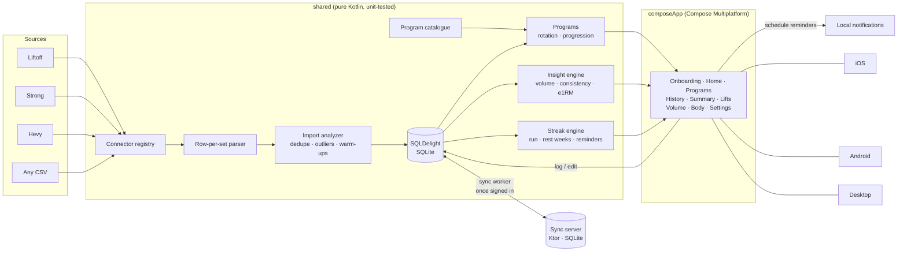

| Module | Contents |
|--------|----------|
| [`shared/`](shared) | Import connectors over a shared row-per-set parser, domain model, exercise and program catalogues, import analyzer, SQLDelight persistence (including the workout in progress), insight engine, streak engine, program rotation and progression logic. Pure Kotlin, no UI, 180+ unit tests including an in-memory SQLite integration test, a schema migration test and a 10,000-row import timing test. |
| [`composeApp/`](composeApp) | Compose Multiplatform UI (goal onboarding, home insights with the next program day, programs and a program editor, history with a workout editor, the end-of-session summary, import preview, lifts, volume, bodyweight, settings), Canvas charts and the Android, iOS and desktop entry points. |
| [`iosApp/`](iosApp) | Xcode project wrapping the `ComposeApp` framework in SwiftUI, plus the Xcode Cloud script. |
| [`server/`](server) | The sync server: Ktor on a SQLite file, sign-in with Google or Apple identity tokens, a per-user document feed and photo blobs. Built on `shared`'s JVM target so both ends share the wire format; tested by syncing two real client databases through the real routes. |
| [`deploy/`](deploy) | The server's systemd unit and nginx block. |
| [`tools/`](tools) | Python for the release process, the TestFlight upload, the server deploy, branch pruning and the exercise photos, with their tests. |
| [`samples/`](samples) | A generated eight-month Liftoff export used by the screenshots and handy for trying the app. |

Dependencies are wired with [Koin](https://insert-koin.io/); each platform supplies a
`DatabaseDriverFactory` and everything else comes from `SharedModule`. Screens use a small
`ScreenModel` state holder over Kotlin Flows; it belongs to the screen's back-stack entry, so a
screen covered by another one (settings, a lift's detail) comes back as it was left rather than
reloading.

### Accounts and sync

On first launch the app asks how to continue. **Continue as guest** keeps everything in the local
database. **Continue with Google / Apple** signs in to the sync server: the phone hands the
provider's identity token to the server, which verifies it against the provider's published keys
and issues a token of its own. From then on a background worker pushes what changed on this
device and pulls what changed on the others, two seconds after an edit and whenever the app
comes to the front. Workouts, their photos, custom exercises, aliases, body weight, programs and
the preferences that are yours rather than the device's all travel; theme, language and the
streak reminder stay put. Signing in on a device that already holds guest data merges it into
the account. Settings shows the current account and lets you return to the sign-in screen; local
data is kept.

Today that is **Sign in with Apple on iOS**, against the server at `api.gains.gerra.sh`: the iOS
app reads the server from `GAINS_SERVER_URL` in `Config.xcconfig` and the sign-in screen shows
only the providers that are wired up. Google on iOS is next; Android and the desktop still run as
guests. [docs/auth-plan.md](docs/auth-plan.md) is the queue of what is left.

What is synced is a set of small JSON documents, one per workout or program, kept in their
latest state on the server with last-writer-wins per document and a change log kept by SQLite
triggers on the device. [docs/sync.md](docs/sync.md) is the whole design: the protocol, the
server, why photos travel outside the feed, and how it is deployed. A provider's button appears
once `AuthConfig` in [`Account.kt`](shared/src/commonMain/kotlin/app/gains/auth/Account.kt) carries
its client id and the server's URL, and the platform registers its native sign-in sheet as an
`IdentityProvider`.

## Development

```bash
./gradlew :shared:desktopTest -Pgains.android=false            # parser, importer, insight and integration tests
./gradlew :composeApp:desktopTest -Pgains.android=false        # UI smoke test that also renders screenshots into composeApp/build/screenshots
./gradlew :composeApp:run -Pgains.android=false                # desktop app
./gradlew :server:test -Pgains.android=false                   # the sync server's routes and a two-device round trip
./gradlew :server:run -Pgains.android=false                    # the sync server on :5003 (needs JWT_SECRET, see secrets/README.md)
./gradlew :shared:compileKotlinIosArm64 :composeApp:compileKotlinIosArm64 -Pgains.android=false  # the iOS compile CI runs on Linux
python3 -m unittest discover -s tools -p 'test_*.py'            # the release, deploy and pruning scripts
```

`-Pgains.android=false` configures the build without the Android Gradle Plugin, which is what
CI does on runners without an SDK. Everything else is unaffected.

**Screenshots.** The [Screenshots workflow](.github/workflows/screenshots.yml) runs the UI test on
a GitHub runner and commits the images under `docs/screenshots`. Trigger it from the Actions tab
after a UI change.

**Releasing.** Every two hours through the day,
[Cut release branch](.github/workflows/release-branch.yml) branches
`release/<major>.<minor>` off `main` and [Release](.github/workflows/release.yml) uploads it
through the [TestFlight workflow](.github/workflows/testflight.yml), which archives the iOS app
on a macOS runner and sends it to App Store Connect, then tags the build, publishes it as a
GitHub release and opens the pull request back to `main`.
[docs/testflight.md](docs/testflight.md#releases-through-the-day) covers the schedule, the secrets and
the manual route through Xcode.

**Adding a connector.** Declare a `ColumnSpec` and a `match` function in
[`CsvConnectors.kt`](shared/src/commonMain/kotlin/app/gains/connectors/CsvConnectors.kt), register
it in `Connectors`, and add a fixture to `ConnectorsTest`.

**Tuning an insight.** Change the defaults in `InsightThresholds` and adjust the corresponding
case in `InsightEngineTest`. Per-goal overrides live in `GoalTuning`.

**Adding a built-in program.** Add a `program { day { slot(...) } }` block to
[`ProgramCatalogue.kt`](shared/src/commonMain/kotlin/app/gains/catalogue/ProgramCatalogue.kt);
`ProgramCatalogueTest` checks that every slot points at a catalogue exercise. Progression rules
are `linear`, `double` (reps climb, then weight) or `ladder` (GZCLP-style stages).

**Tuning GZCLP starts, warm-ups and rest.** Every constant lives in
[`Gzclp.kt`](shared/src/commonMain/kotlin/app/gains/program/Gzclp.kt): the tier fractions of
the estimated 1RM, the warm-up steps, the default bar weight and increments, and the rest ranges.
`GzclpTest` covers the rounding, the "never above a failed weight" rule and warm-up generation.

**Changing the schema.** Edit the `.sq` file and add a `migrations/N.sqm` with the same DDL;
`MigrationTest` upgrades a database from the previous version and compares it with a fresh one.
A new table that should sync also needs its three triggers in
[`Sync.sq`](shared/src/commonMain/sqldelight/app/gains/db/Sync.sq) and a document class in
[`Documents.kt`](shared/src/commonMain/kotlin/app/gains/sync/Documents.kt); `SyncStoreTest`
checks that what the repositories write is what the triggers record.

**The sync server.** Lives in [`server/`](server) and is deployed by the
[Deploy server workflow](.github/workflows/deploy.yml) on a push to `main` that touches it:
tests, `installDist`, rsync to the Hetzner box, the systemd unit from `deploy/`, a smoke test.
The steps are [`tools/deploy_server.py`](tools/deploy_server.py), which also runs on the
box for the install itself; from a laptop, `python3 tools/deploy_server.py nginx` pushes the
nginx block and `python3 tools/deploy_server.py secrets` the secrets
([secrets/README.md](secrets/README.md) lists them). A server-only change cuts no release branch. Design and routes: [docs/sync.md](docs/sync.md).

**Pruning branches.** `python3 tools/prune_branches.py list` shows the branches on origin whose
work is already on `main`, and `prune` deletes them. `release/*` branches are always kept: the
next version number is worked out from them.

**Exercise photos.** `python3 tools/exercise_demos.py` (needs Pillow) matches every catalogue
exercise to a [free-exercise-db](https://github.com/yuhonas/free-exercise-db) entry by its
`// src:` comment, name and aliases, downloads the two photos, scales them to 480 px WebP under
`composeApp/src/commonMain/composeResources/files/exercises/<id>/` and regenerates
`ExerciseDemos.kt`, the table of which exercises have photos and where each came from. Pin a
better photo set in the script's `OVERRIDES`, or list an exercise the database has no photos
for in `SKIP`; `ExerciseDemosTest` checks the table, the files and the catalogue agree. A new
catalogue exercise makes the script stop until it is in one of the two.

### Languages

Every sentence, label and unit the app shows is a string resource:
[`composeApp/src/commonMain/composeResources/values/strings.xml`](composeApp/src/commonMain/composeResources/values/strings.xml)
is the English reference and `values-ru/strings.xml` the Russian, with plurals (`<plurals>`)
and month and day names (`<string-array>`) alongside the plain strings. Screens read them
with `stringResource`; screen models, which live outside the composition, through `Texts`,
which carries the composition's resource environment to them. The shared module knows no language: the insight engine, the progression hints,
the day planner and the CSV parser return structured values (`InsightDetail`,
`Progression.Hint`, `CsvProblem`) and the UI words them in
[`composeApp/src/commonMain/kotlin/app/gains/ui/i18n/`](composeApp/src/commonMain/kotlin/app/gains/ui/i18n).
**Settings → Language** picks one, or leaves it to the device. The choice is a preference like
any other (`AppLanguage`, read back through `SettingsRepository`), and `InLanguage` — around the
whole UI — puts it in force as the platform's current locale, which is where the string resources
take theirs from, and then composes everything below it afresh. The app is therefore in the new
language as the chip is tapped, and the back stack and the scroll positions are where they were;
screen models are made anew along with it, since each holds the words it was made with. On Android
13 and up the choice is handed to the system's own per-app language as well, so the workout
notification, whose strings are Android resources rather than Compose ones, follows too; on older
Android that one notification stays in the device's language.
The built-in exercises, programs,
day names and slot notes stay in English in the database and are looked up on the way to the
screen by a key derived from their id (`exercise_bench_press`, `program_gzclp`,
`day_workout_a`), so imports and aliases are unaffected; custom exercises and programs are shown
as typed.

**Adding a language.** Add a `values-xx/strings.xml` with every key of the English file
(`LocalizationResourcesTest` checks the two match and that every built-in exercise, program,
day and slot note is covered), an entry to `AppLanguage` with its tag, a `language_xx` string
naming it in its own words (the same text in every file: each language names itself), the locale to
`composeApp/src/androidMain/res/xml/locales_config.xml`, a `values-xx/strings.xml` under
`composeApp/src/androidMain/res` for the Android notification, and to `CFBundleLocalizations`
in `iosApp/iosApp/Info.plist`.

## Roadmap

- [x] Self-hosted sync server and the client that speaks to it ([docs/sync.md](docs/sync.md))
- [x] Sign in with Apple on iOS, syncing through `api.gains.gerra.sh`
- [ ] Sign in with Google on iOS, then linking a guest account, deleting an account and sync status in Settings ([docs/auth-plan.md](docs/auth-plan.md))
- [ ] Sign-in on Android (Google through Credential Manager)
- [ ] Keep the sync token in the Keychain and the Android Keystore rather than the app database
- [ ] More connectors: a `ColumnSpec` and a `match` function each, contributions welcome

## Known limitations

- The Android source set is written against the standard APIs but is not compiled in CI, which
  runs without an Android SDK. Open the project in Android Studio to build it.
- The iOS app compiles to Kotlin/Native klibs on any host, and CI does so on every pull request,
  but linking, running and archiving it needs Xcode on a Mac (the TestFlight workflow uses a
  hosted macOS runner for this).
- Only Sign in with Apple on iOS is wired up so far; Android and the desktop run as guests, so
  their data stays on the device.

## Contributing

Issues and pull requests are welcome. Keep the shared module free of platform code, add a test
for anything the parser or an insight rule should handle, and run what CI runs before opening a
PR: `./gradlew :shared:desktopTest :composeApp:desktopTest :server:test -Pgains.android=false`,
plus the iOS compile and the `tools/` tests listed under [Development](#development).

## Acknowledgements

- [Compose Multiplatform](https://www.jetbrains.com/compose-multiplatform/) for the UI
- [SQLDelight](https://sqldelight.github.io/sqldelight/) for typed SQLite
- [Koin](https://insert-koin.io/) for dependency injection
- [kotlinx-datetime](https://github.com/Kotlin/kotlinx-datetime) for dates without tears
- [react-native-body-highlighter](https://github.com/HichamELBSI/react-native-body-highlighter) (MIT,
  © 2022 ELABBASSI Hicham) for the body drawing behind the muscle map, ported to Compose path data
- [free-exercise-db](https://github.com/yuhonas/free-exercise-db) (public domain, Unlicense) for
  the exercise photos and for the names of about 180 catalogue exercises
- The README layout borrows from the projects collected in [awesome-readme](https://github.com/matiassingers/awesome-readme)

## License

No license has been chosen yet, so all rights are reserved by the author until one is added.
