<h1 align="center">
  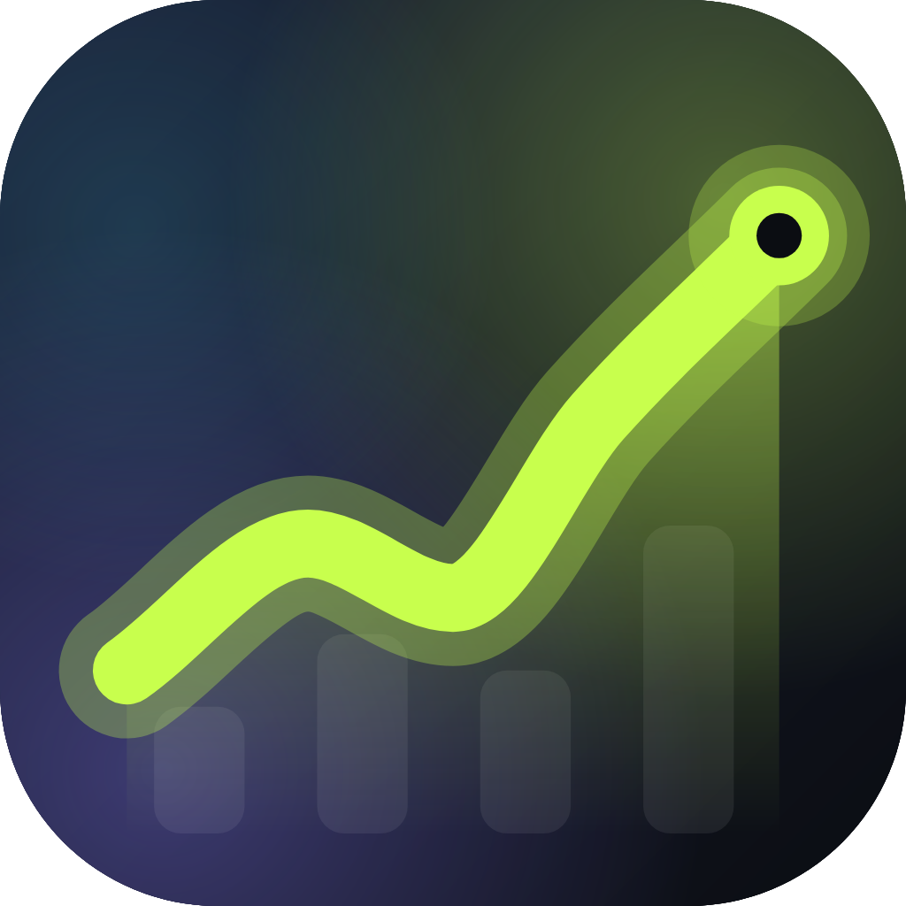<br>
  Gains
</h1>

<p align="center"><strong>Know what's actually moving.</strong></p>

<p align="center">
  A training log that imports your history from Liftoff, Strong, Hevy or any workout CSV<br>
  and tells you which lifts are climbing, which have stalled and which are slipping.
</p>

<p align="center">
  <a href="https://github.com/gerra/gains/actions/workflows/ci.yml"></a>
  
  
  
  
</p>

<p align="center">
  <a href="#features">Features</a> ·
  <a href="#screenshots">Screenshots</a> ·
  <a href="#getting-started">Getting started</a> ·
  <a href="#importing-your-history">Importing</a> ·
  <a href="#insights">Insights</a> ·
  <a href="#architecture">Architecture</a> ·
  <a href="#contributing">Contributing</a>
</p>

<p align="center">
  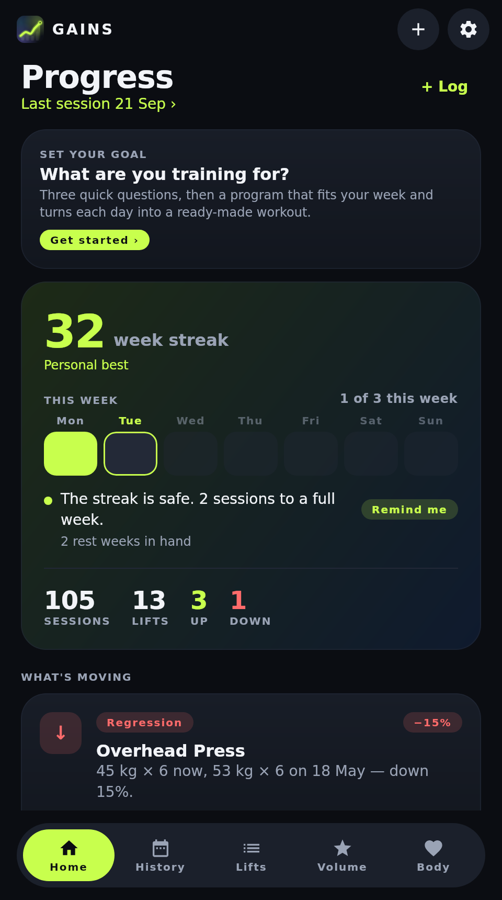&nbsp;
  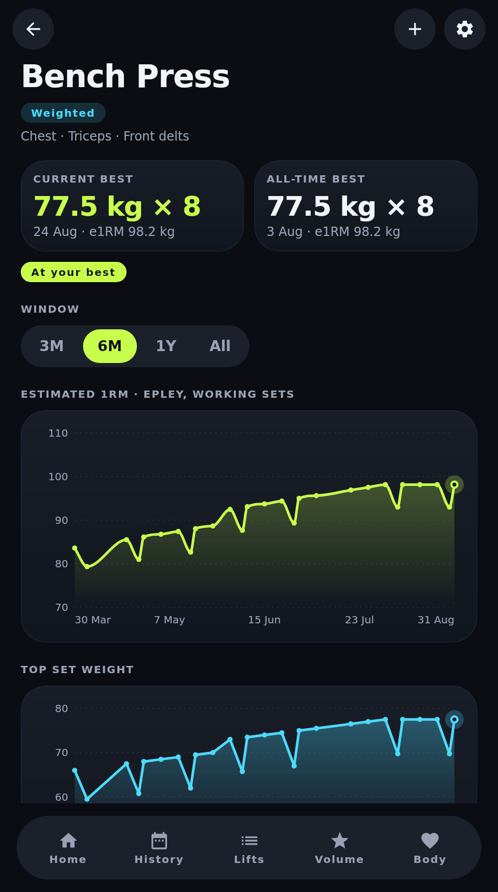&nbsp;
  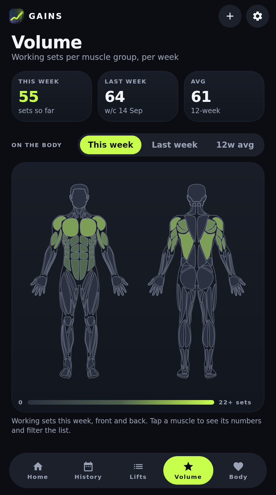
</p>

---

## Why Gains

Most training apps are good at recording sets and bad at answering the only question that
matters weeks later: *is this working?* Gains keeps your whole history, including the years
you logged elsewhere, and turns it into a handful of plain statements: bench is up 6%, deadlift
has been stuck at the same top weight for seven weeks, you have not trained rear delts this
month. Every statement comes with the numbers and the chart behind it.

It is a [Kotlin Multiplatform](https://kotlinlang.org/docs/multiplatform.html) app with a
[Compose Multiplatform](https://www.jetbrains.com/compose-multiplatform/) UI. iOS is the primary
target; Android and a desktop (JVM) build share the same code. Everything lives in a local
SQLite database on the device. A self-hosted sync server is planned but nothing leaves your
device today.

<details>
<summary><strong>Table of contents</strong></summary>

- [Why Gains](#why-gains)
- [Features](#features)
- [Screenshots](#screenshots)
- [Getting started](#getting-started)
  - [Desktop](#desktop)
  - [Android](#android)
  - [iOS](#ios)
- [Importing your history](#importing-your-history)
  - [Supported exports](#supported-exports)
  - [What happens to a file](#what-happens-to-a-file)
- [Insights](#insights)
- [Architecture](#architecture)
- [Development](#development)
- [Roadmap](#roadmap)
- [Known limitations](#known-limitations)
- [Contributing](#contributing)
- [Acknowledgements](#acknowledgements)
- [License](#license)

</details>

## Features

- **Import from anywhere.** Drop in Liftoff, Strong or Hevy exports, or any CSV with date,
  exercise, weight and reps columns. The format is detected from the header, several files can
  be imported at once, and re-importing an overlapping export never creates duplicates.
- **Honest insights.** Six rules, each a pure function with tunable thresholds, report
  progress, regressions, stalls, neglected lifts, neglected muscle groups and consistency.
  Nothing is reported without the sessions to back it up.
- **Per-lift analysis.** Estimated 1RM (Epley) over working sets, top set weight, volume per
  session and best set per session, over 3-month, 6-month, 1-year or all-time windows.
- **Weekly volume by muscle group.** Working sets per week with primary and secondary credit,
  flagged as maintenance under 8 sets and likely junk volume over 22.
- **Log and edit workouts.** Add sessions in the app, edit imported ones (date, duration,
  exercises, sets, notes) and have the edits flow into the same analyses.
- **Bodyweight tracking** with a 7-day average, and any lift overlaid on the trend.
- **A catalogue that understands names.** About 100 built-in exercises with muscle
  contributions and aliases, so `Seated Dumbbell Shoulder Press` and `Seated Shoulder Press`
  are one lift. Unknown names become custom exercises you can merge later.
- **Careful with bad data.** Real RFC 4180 parsing, unit conversion and rounding, warm-up
  detection, timer-default holds flagged for review, corrupt durations dropped, empty rows
  listed with a reason.
- **Dark and light themes**, a floating pill navigation and animated Canvas charts with no
  charting library.
- **Local first.** Guest mode keeps everything on the device. Sign-in and sync light up only
  once a server exists.

## Screenshots

All images are rendered from the real app by [a headless UI test](composeApp/src/desktopTest/kotlin/app/gains/ScreenshotTest.kt)
against the [sample export](samples/liftoff-export.csv), so they stay current.

<table>
  <tr>
    <td align="center">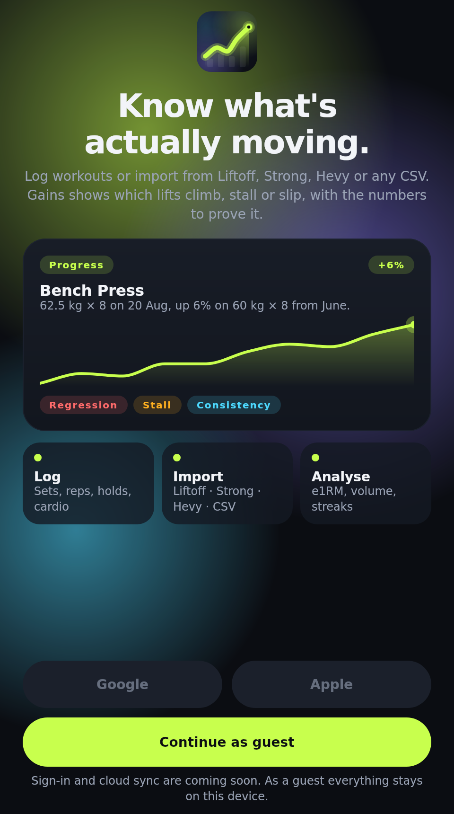<br><sub>Welcome</sub></td>
    <td align="center">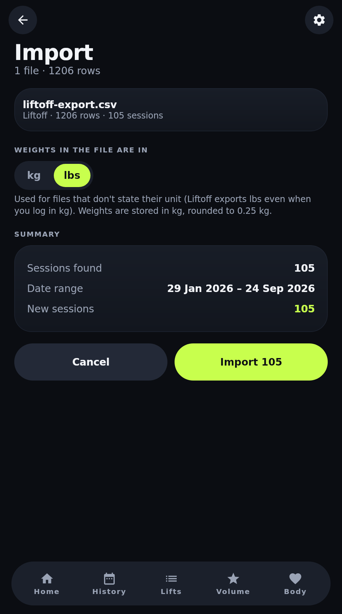<br><sub>Import preview</sub></td>
    <td align="center"><br><sub>Home: what's moving</sub></td>
    <td align="center">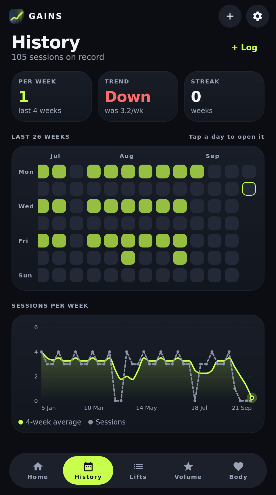<br><sub>History and heat-map</sub></td>
  </tr>
  <tr>
    <td align="center">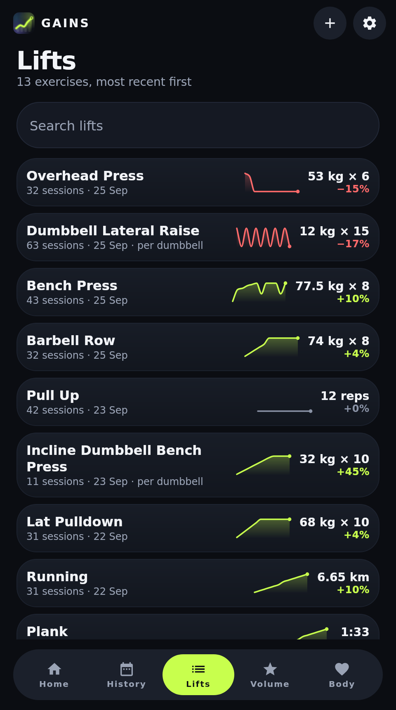<br><sub>Lifts with sparklines</sub></td>
    <td align="center"><br><sub>Lift detail</sub></td>
    <td align="center"><br><sub>Weekly volume</sub></td>
    <td align="center">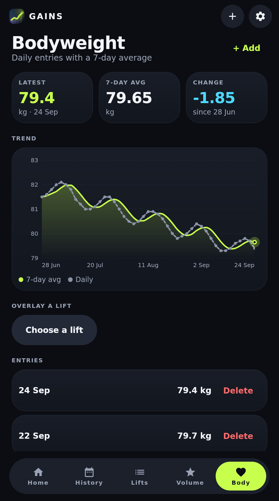<br><sub>Bodyweight</sub></td>
  </tr>
  <tr>
    <td align="center">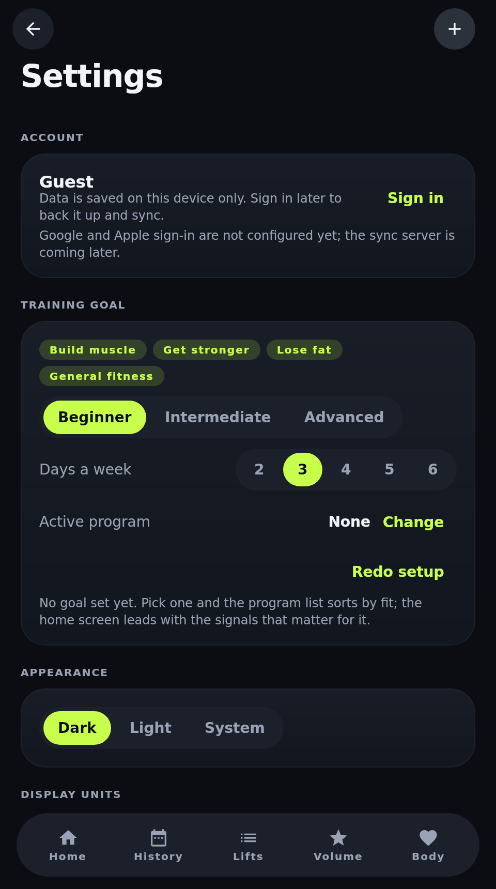<br><sub>Settings</sub></td>
    <td align="center">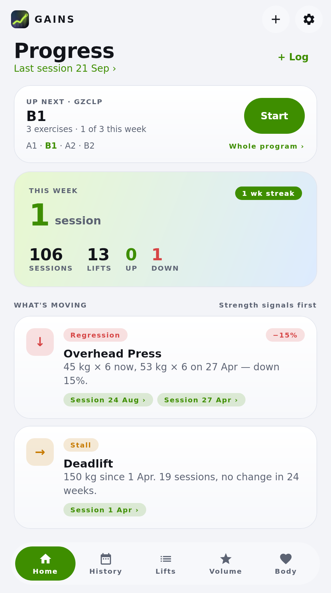<br><sub>Light theme</sub></td>
    <td align="center">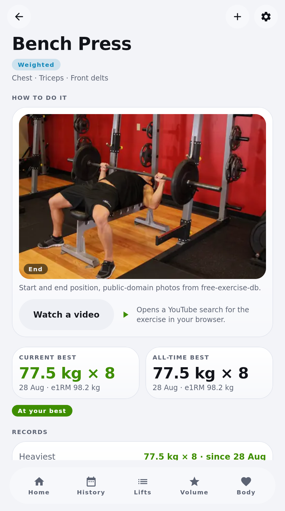<br><sub>Lift detail, light</sub></td>
    <td></td>
  </tr>
</table>

## Getting started

Requirements: JDK 17 or newer. Android additionally needs Android Studio with SDK 35, iOS needs
Xcode 15 or newer on a Mac.

```bash
git clone https://github.com/gerra/gains.git
cd gains
```

### Desktop

The desktop build is the quickest way to try the app or work on it. It has no dependency on the
Android SDK when you pass `-Pgains.android=false`.

```bash
# run the app
./gradlew :composeApp:run -Pgains.android=false

# open straight into the import preview with the bundled sample export
./gradlew :composeApp:run -Pgains.android=false -Pgains.openFile=samples/liftoff-export.csv

# run the tests
./gradlew :shared:desktopTest -Pgains.android=false
```

Pick **Continue as guest** on first launch, then import a file with the **+** button or log a
workout from the Home tab. The database lives in `~/.gains/gains.db`.

### Android

Open the project in Android Studio and run the `composeApp` configuration, or build an APK:

```bash
./gradlew :composeApp:assembleDebug
```

The app registers as a handler for CSV files, so exports shared from other apps open directly in
the import preview. Several files can be shared at once.

### iOS

```bash
open iosApp/iosApp.xcodeproj
```

Fill in `TEAM_ID` in `iosApp/Configuration/Config.xcconfig`, pick a device or simulator and run.
The Xcode project wraps the `ComposeApp` framework in SwiftUI and registers the app as a CSV
handler, so **Open in Gains** appears in the share sheet.

## Importing your history

### Supported exports

Every source implements `ImportConnector`: it recognises a file by its header and turns the rows
into sessions. The registry auto-detects the format, so you only ever pick files.

| Connector | Detects | Notes |
|-----------|---------|-------|
| **Liftoff** | The fixed Liftoff column order | Weights in lbs at float precision, `01 hours 00 minutes 00 seconds` durations. |
| **Strong** | `Workout Notes` or `Weight Unit` columns | Old and new export layouts, per-row weight and distance units, `1h 5m` durations. |
| **Hevy** | `exercise_title` and `start_time` | `weight_kg` / `weight_lbs` columns, `5 Jan 2026, 18:30` timestamps, duration from start and end times. |
| **Workout CSV** | Any date, exercise, weight and reps columns under common names | The fallback for spreadsheets and other apps. You choose the weight unit in the preview. |

Adding a connector is a `ColumnSpec` plus a `match` function; parsing, duplicate detection and
outlier handling are shared. Sessions remember their connector in the `source` column, and
workouts logged in the app carry `manual`.

### What happens to a file

Nothing is written until you confirm the preview. Along the way:

1. The file is read with an RFC 4180 parser, so quoted notes with commas and line breaks are fine.
2. Rows are grouped into sessions by timestamp and sorted. File order is never trusted.
3. Weights are converted to kg and rounded to 0.25 kg (`132.277357311 lbs` becomes `60 kg`).
   Files that do not state a unit get a unit picker in the preview.
4. Each set is classified as weighted, bodyweight, isometric or cardio. Empty rows are discarded
   and listed with the reason. Durations over four hours are dropped as timer errors.
5. Exercise names are mapped onto the catalogue through aliases. Unknown names become custom
   exercises with guessed muscle groups. You can merge them into a catalogue exercise in
   Settings, which records an alias for future imports.
6. Near-duplicate sessions (same day, same exercises, same set count) are detected inside the
   file, across files and against the database, and only one copy is kept.
7. Isometric holds more than five times the usual hold for that exercise are flagged. You decide
   per hold whether to keep or discard them.
8. Warm-ups are inferred per exercise per session: weighted sets under 85% of the session's top
   weight. The percentage can be overridden per lift.
9. Re-importing an overlapping export is safe: stored sessions are skipped, changed ones are
   replaced, new ones are added.

<details>
<summary>Importing several files at once</summary>

Multi-select in the Files picker, Android's document picker or the desktop dialog; the share
sheet accepts several files too. Files are parsed independently, a session that appears in more
than one file is stored once (the copy with more sets wins), and the merged set is then
de-duplicated against itself and the database exactly as a single file would be.

</details>

## Insights

Insight rules are pure functions in [`InsightEngine.kt`](shared/src/commonMain/kotlin/app/gains/analysis/InsightEngine.kt)
with their thresholds gathered in `InsightThresholds`. The defaults:

| Insight | Rule |
|---------|------|
| **Progress** | Best performance in the last 30 days beats the earlier all-time best by at least 2.5%. |
| **Regression** | Best performance in the last 30 days is at least 5% below the all-time best before that window. Weighted lifts compare Epley e1RM, bodyweight lifts reps, holds seconds, cardio distance. |
| **Stall** | Top working weight unchanged for 6+ weeks with at least 4 sessions in that time, and the lift was trained in the last 4 weeks. Not reported when a regression already is. |
| **Neglected lift** | Trained 4+ times in a 12-week span, then absent for 4+ weeks. |
| **Neglected muscle** | Averaged 8+ working sets a week over the previous 8 weeks, now under 4 a week over the last 2. |
| **Consistency** | Sessions per week over the last 4 weeks against the 4 before. Within 15% counts as steady. |

Volume credits 1.0 set to primary muscle groups and 0.5 to secondary ones across 17 groups.

## Architecture

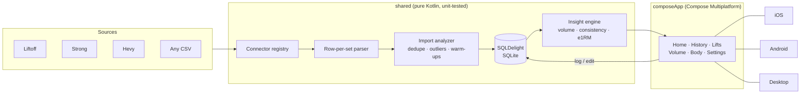

| Module | Contents |
|--------|----------|
| [`shared/`](shared) | Import connectors over a shared row-per-set parser, domain model, exercise catalogue, import analyzer, SQLDelight persistence, insight engine and analysis code. Pure Kotlin, no UI, 60+ unit tests including an in-memory SQLite integration test and a 10,000-row import timing test. |
| [`composeApp/`](composeApp) | Compose Multiplatform UI (home insights, history with a workout editor, import preview, lifts, volume, bodyweight, settings), Canvas charts and the Android, iOS and desktop entry points. |
| [`iosApp/`](iosApp) | Xcode project wrapping the `ComposeApp` framework in SwiftUI. |
| [`samples/`](samples) | A generated eight-month Liftoff export used by the screenshots and handy for trying the app. |

Dependencies are wired with [Koin](https://insert-koin.io/); each platform supplies a
`DatabaseDriverFactory` and everything else comes from `SharedModule`. Screens use a small
`ScreenModel` state holder over Kotlin Flows.

### Accounts and sync

On first launch the app asks how to continue. **Continue as guest** keeps everything in the local
database. **Continue with Google / Apple** are present but disabled: they light up once
`AuthConfig` in [`Account.kt`](shared/src/commonMain/kotlin/app/gains/auth/Account.kt) carries a
Google client id, an Apple service id and the sync server's base URL. Settings shows the current
account and lets you return to the sign-in screen; local data is kept.

## Development

```bash
./gradlew :shared:desktopTest -Pgains.android=false            # parser, importer, insight and integration tests
./gradlew :composeApp:desktopTest -Pgains.android=false        # UI smoke test that also renders screenshots into composeApp/build/screenshots
./gradlew :composeApp:run -Pgains.android=false                # desktop app
```

`-Pgains.android=false` configures the build without the Android Gradle Plugin, which is what
CI does on runners without an SDK. Everything else is unaffected.

**Screenshots.** The [Screenshots workflow](.github/workflows/screenshots.yml) runs the UI test on
a GitHub runner and commits the images under `docs/screenshots`. Trigger it from the Actions tab
after a UI change.

**Adding a connector.** Declare a `ColumnSpec` and a `match` function in
[`CsvConnectors.kt`](shared/src/commonMain/kotlin/app/gains/connectors/CsvConnectors.kt), register
it in `Connectors`, and add a fixture to `ConnectorsTest`.

**Tuning an insight.** Change the defaults in `InsightThresholds` and adjust the corresponding
case in `InsightEngineTest`.

## Roadmap

- [ ] Self-hosted sync server and the Google / Apple sign-in it unlocks
- [ ] Export back to CSV
- [ ] More connectors (contributions welcome)

## Known limitations

- The Android source set is written against the standard APIs but is not compiled in CI, which
  runs without an Android SDK. Open the project in Android Studio to build it.
- The iOS app compiles to Kotlin/Native klibs on any host, but linking and running it needs
  Xcode on a Mac.
- Sign-in buttons are placeholders until the sync server exists.

## Contributing

Issues and pull requests are welcome. Keep the shared module free of platform code, add a test
for anything the parser or an insight rule should handle, and run the desktop tests before
opening a PR.

## Acknowledgements

- [Compose Multiplatform](https://www.jetbrains.com/compose-multiplatform/) for the UI
- [SQLDelight](https://sqldelight.github.io/sqldelight/) for typed SQLite
- [Koin](https://insert-koin.io/) for dependency injection
- [kotlinx-datetime](https://github.com/Kotlin/kotlinx-datetime) for dates without tears
- The README layout borrows from the projects collected in [awesome-readme](https://github.com/matiassingers/awesome-readme)

## License

No license has been chosen yet, so all rights are reserved by the author until one is added.
