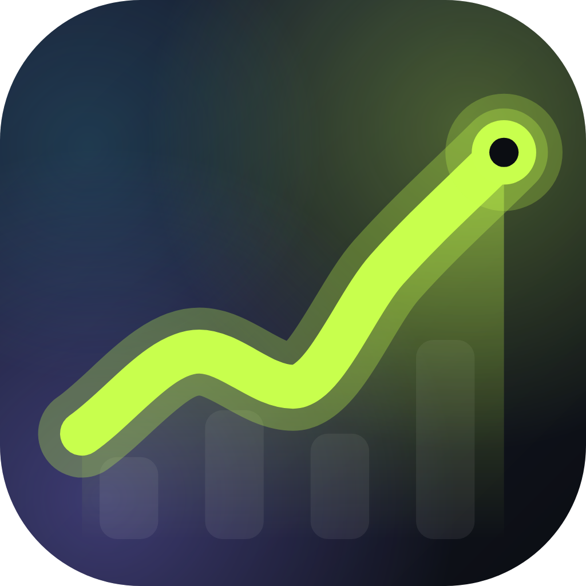
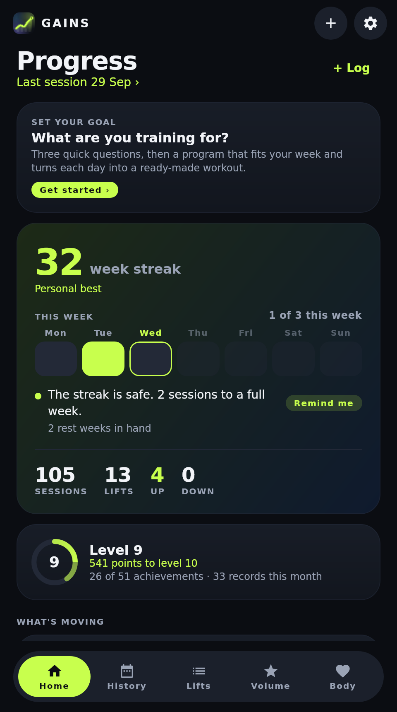
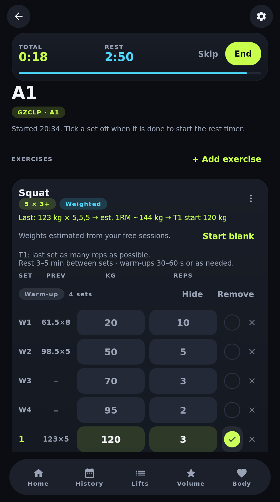
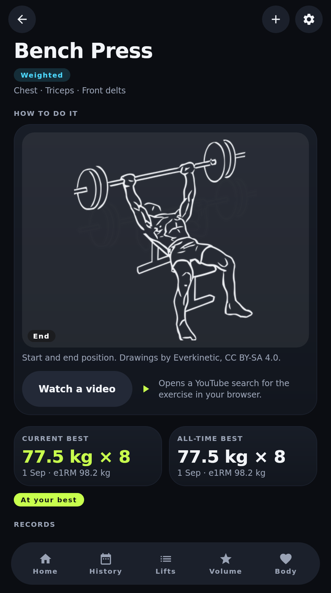
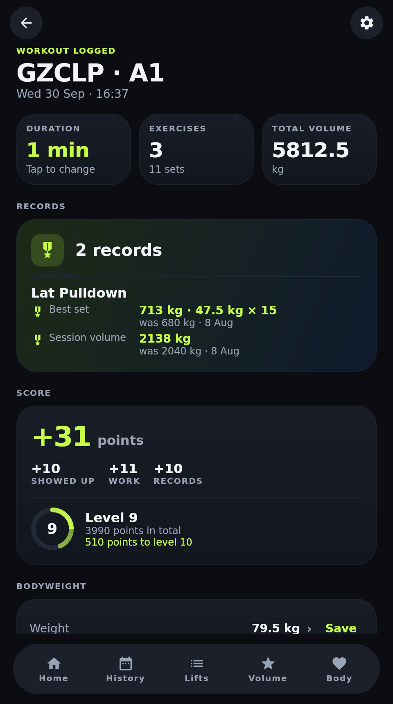

<h1 align="center">
  <br>
  Gains
</h1>

<p align="center"><strong>Know what's actually moving.</strong></p>

<p align="center">
  A training log that imports your history from Liftoff, Strong, Hevy or any workout CSV<br>
  and tells you which lifts are climbing, which have stalled and which are slipping.
</p>

<p align="center">
  <a href="https://github.com/gerra/gains/actions/workflows/ci.yml"></a>
  <a href="https://github.com/gerra/gains/releases/latest"></a>
  
  
</p>

<p align="center">
  
  
  
  
</p>

Website, privacy policy and support: **https://gains.gerra.sh**

## Features

- **Import your history** from Liftoff, Strong, Hevy or any CSV. Re-importing never duplicates.
- **Insights** on what's progressing, stalled, slipping or neglected, with the numbers behind each.
- **Programs** like GZCLP, 5/3/1 for Beginners and Reddit PPL, pre-filled from your last session.
- **Timed workouts** with a rest timer, and a summary with a photo when you finish.
- **Charts**: estimated 1RM, weekly volume on a body map, bodyweight.
- **Week streaks** that survive a rest week.
- **Records, a score and achievements**: every record the workout set, named exactly; a score you can add up yourself; six ladders earned by training alone.
- **Local first.** Data lives on the device; signing in with Apple or Google, on iOS, Android or the desktop, syncs it through a self-hosted server.
- **English and Russian.**

All of it, with every screenshot: [docs/features.md](docs/features.md).

## TestFlight

### Join the beta

Install [TestFlight](https://apps.apple.com/app/testflight/id899247664) (iOS 16+) and open
**https://testflight.apple.com/join/T4dqvPW7** on your iPhone. The newest build is the
[latest release](https://github.com/gerra/gains/releases/latest).

Builds ship from `main` every two hours through the day: [docs/testflight.md](docs/testflight.md),
and the same rounds send the Android build to Play's closed test: [docs/play.md](docs/play.md).

## Build from source

JDK 17+. Android needs the Android SDK 37; iOS needs Xcode on a Mac.

```bash
./gradlew :composeApp:run -Pgains.android=false   # desktop, the quickest way to try it
./gradlew :androidApp:assembleDebug                # Android
open iosApp/iosApp.xcodeproj                       # iOS
```

Add `-Pgains.openFile=samples/liftoff-export.csv` to the desktop run to start from a sample import.

## Development

```bash
./gradlew :shared:desktopTest :composeApp:desktopTest :server:test -Pgains.android=false
```

| Module | |
|--------|--|
| [`shared/`](shared) | Importers, database, insight and streak engines, programs, the sync client. Pure Kotlin. |
| [`composeApp/`](composeApp) | Compose Multiplatform UI for iOS, Android and desktop. |
| [`androidApp/`](androidApp) | The Android application around it: id, version, signing, R8. |
| [`iosApp/`](iosApp) | The Xcode project. |
| [`server/`](server) | The sync server (Ktor, SQLite). |
| [`tools/`](tools) | Release, TestFlight, Google Play and deploy scripts. |
| [`site/`](site) | [gains.gerra.sh](https://gains.gerra.sh): landing page, privacy policy, support. Static HTML. |

More: [how it works](docs/how-it-works.md) · [development](docs/development.md) ·
[sync](docs/sync.md) · [TestFlight](docs/testflight.md) · [Google Play](docs/play.md) · [launch plan](docs/launch-plan.md)

## Contributing

Contributions are welcome, and are accepted under MPL-2.0, the license they are contributed to.
There is no CLA and no sign-off.

## License

Copyright © 2026 German Berezhko

Gains' own source code is licensed under the [Mozilla Public License 2.0](LICENSE): this Source
Code Form is subject to the terms of the Mozilla Public License, v. 2.0. If a copy of the MPL was
not distributed with this file, You can obtain one at https://mozilla.org/MPL/2.0/.

Not everything in the repository is Gains' own. The body drawing comes from
[react-native-body-highlighter](https://github.com/HichamELBSI/react-native-body-highlighter) and
keeps its MIT license, and some of the exercise names from
[free-exercise-db](https://github.com/yuhonas/free-exercise-db) (public domain).
[NOTICE.md](NOTICE.md) lists what the license covers and what it doesn't. The name "Gains" and its
logo are not licensed for use as a name or mark: a build from a fork takes a name and icon of its
own. The rest of the credits are in [docs/development.md](docs/development.md#built-with).
