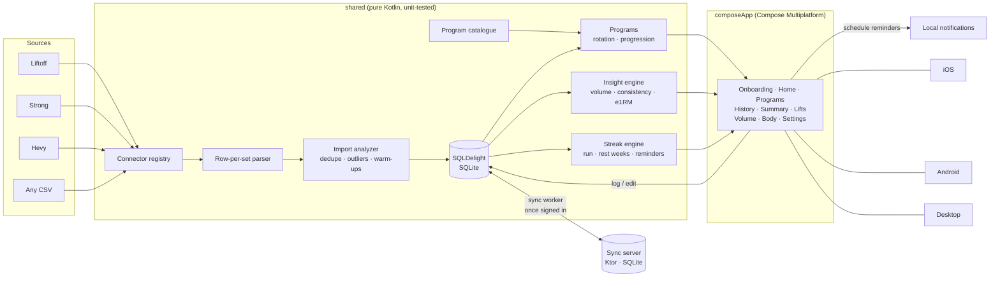

# How it works

Importing, the insight and streak rules, and the architecture. The overview is in the
[README](../README.md).

## Importing your history

### Supported exports

Every source implements `ImportConnector`: it recognises a file by its header and turns the rows
into sessions. The registry auto-detects the format, so you only ever pick files.

| Connector | Detects | Notes |
|-----------|---------|-------|
| **Liftoff** | The fixed Liftoff column order | Weights in lbs at float precision, `01 hours 00 minutes 00 seconds` durations. |
| **Strong** | `Workout Notes` or `Weight Unit` columns | Old and new export layouts, per-row weight and distance units, `1h 5m` durations. |
| **Hevy** | `exercise_title` and `start_time` | `weight_kg` / `weight_lbs` columns, `5 Jan 2026, 18:30` timestamps, duration from start and end times. |
| **Workout CSV** | Any date, exercise, weight and reps columns under common names | The fallback for spreadsheets and other apps. You choose the weight unit in the preview. |

Adding a connector is a `ColumnSpec` plus a `match` function; parsing, duplicate detection and
outlier handling are shared. Sessions remember their connector in the `source` column, and
workouts logged in the app carry `manual`.

### What happens to a file

Nothing is written until you confirm the preview. Along the way:

1. The file is read with an RFC 4180 parser, so quoted notes with commas and line breaks are fine.
2. Rows are grouped into sessions by timestamp and sorted. File order is never trusted.
3. Weights are converted to kg and rounded to 0.25 kg (`132.277357311 lbs` becomes `60 kg`).
   Files that do not state a unit get a unit picker in the preview.
4. Each set is classified as weighted, bodyweight, isometric or cardio. Empty rows are discarded
   and listed with the reason. Durations over four hours are dropped as timer errors.
5. Exercise names are mapped onto the catalogue through aliases. Unknown names become custom
   exercises with guessed muscle groups. You can merge them into a catalogue exercise in
   Settings, which records an alias for future imports.
6. A session is a calendar day: blocks logged at different times on one day are merged, exact
   copies are dropped, the same day across several files is kept once, and a stored session
   that matches on date, exercises and set count is recognised rather than duplicated.
7. Isometric holds more than five times the usual hold for that exercise are flagged. You decide
   per hold whether to keep or discard them.
8. Warm-ups are inferred per exercise per session: weighted sets under 85% of the session's top
   weight. The percentage can be overridden per lift. Only warm-ups you marked (or a program day
   planned) are stored; inferred ones are recomputed on every read, so changing the percentage
   re-classifies old sessions.
9. Re-importing an overlapping export is safe: stored sessions are skipped, changed ones are
   replaced, new ones are added.

Importing several files at once

Multi-select in the Files picker, Android's document picker or the desktop dialog; the share
sheet accepts several files too. Files are parsed independently, a session that appears in more
than one file is stored once (the copy with more sets wins), and the merged set is then
de-duplicated against itself and the database exactly as a single file would be.

## Insights

Insight rules are pure functions in [`InsightEngine.kt`](../shared/src/commonMain/kotlin/app/gains/analysis/InsightEngine.kt)
with their thresholds gathered in `InsightThresholds`. The defaults:

| Insight | Rule |
|---------|------|
| **Progress** | Best performance in the last 30 days beats the earlier all-time best by at least 2.5%. |
| **Regression** | Best performance in the last 30 days is at least 5% below the all-time best before that window. Weighted lifts compare Epley e1RM, bodyweight lifts reps, holds seconds, cardio distance. |
| **Stall** | Top working weight unchanged for 6+ weeks with at least 4 sessions in that time, and the lift was trained in the last 4 weeks. Not reported when a regression already is. |
| **Neglected lift** | Trained 4+ times in a 12-week span, then absent for 4+ weeks. |
| **Neglected muscle** | Averaged 8+ working sets a week over the previous 8 weeks, now under 4 a week over the last 2. |
| **Consistency** | Sessions per week over the last 4 weeks against the 4 before. Within 15% counts as steady. |

Volume credits 1.0 set to primary muscle groups and 0.5 to secondary ones across 17 groups.

The Volume tab draws working sets on a body, front and back
([`BodyMap.kt`](../composeApp/src/commonMain/kotlin/app/gains/ui/charts/BodyMap.kt)): each muscle is
shaded from the resting body colour at zero sets to the full accent at 22, for this week, last week
or the average over the trend window (the most recent one with any sets is shown first), and tapping
a muscle shows its numbers and narrows the list below to it. The drawing is a set of SVG paths rendered on a Compose
`Canvas`, so it needs no platform code and taps are hit-tested against the paths themselves. The
drawing is coarser than the 17 groups in a few places: its one deltoid per view stands for front
and side delts on the front, rear and side delts on the back; abs and obliques together are core;
adductors and tibialis are drawn but not tracked.

## Streaks and the nudge

The whole streak is one forward pass over the session history in
[`StreakEngine.kt`](../shared/src/commonMain/kotlin/app/gains/analysis/StreakEngine.kt). Nothing is
stored: importing ten years of history, editing a session's date or deleting one all give the streak
that history deserves, with no state to migrate and nothing that can drift out of step with what is
actually logged.

| Rule | |
|------|--|
| **Week** | ISO Monday to Sunday. |
| **Kept** | At least one session in the week. The week still running is pending, neither kept nor missed. |
| **Rest week** | One banked per 4 kept weeks, 2 at most. A missed week spends one: the run holds but does not advance, because a week off is not a week trained. A broken run clears the bank. |
| **Goal** | The active program's days a week, else the onboarding answer, else 3. It fills the week ring and is never what breaks a streak. |
| **Milestones** | 4, 8, 12, 26, 52 and 104 weeks, then yearly — rare enough that each one registers. |

The reminder is the part most apps get wrong, so it is deliberately quiet. It is **off until asked
for**: the card offers it once there are two weeks to protect, and turning it on is what brings up
the system's permission prompt, at a moment the lifter chose. After that:

- Nothing is sent in a week that already has a session in it. Training is the off switch.
- At most two go out in a week that does not: one on Saturday, one on Sunday.
- They arrive at the hour you usually train — the most common start hour of your last 30 sessions,
  kept between 09:00 and 20:00 — not at an hour the app picked.
- With a rest week banked, the reminder says a rest week is what a miss would cost, because that is
  what is true. The wording never claims the run is about to end when it is not; there is a test
  that says so.

The words are worked out when the plan is made, by the code that knows both the streak and the
[chosen language](development.md#languages), and handed to the platform finished: by the time one is shown the app
may be asleep, killed, or on a device that has rebooted since. The plan is made under `InLanguage`,
so switching language re-words the reminders still to come rather than leaving them in the old one.
iOS holds them as scheduled `UNNotificationRequest`s, Android as inexact `AlarmManager` alarms
restored after a reboot, and the desktop has nowhere to put one. Every plan replaces the last one
whole, so saving a workout on Saturday morning takes the evening's reminder down before it is ever
shown.

## Architecture

| Module | Contents |
|--------|----------|
| [`shared/`](../shared) | Import connectors over a shared row-per-set parser, domain model, exercise and program catalogues, import analyzer, SQLDelight persistence (including the workout in progress), insight engine, streak engine, program rotation and progression logic. Pure Kotlin, no UI, 180+ unit tests including an in-memory SQLite integration test, a schema migration test and a 10,000-row import timing test. |
| [`composeApp/`](../composeApp) | Compose Multiplatform UI (goal onboarding, home insights with the next program day, programs and a program editor, history with a workout editor, the end-of-session summary, import preview, lifts, volume, bodyweight, settings), Canvas charts and the Android, iOS and desktop entry points. |
| [`iosApp/`](../iosApp) | Xcode project wrapping the `ComposeApp` framework in SwiftUI, plus the Xcode Cloud script. |
| [`server/`](../server) | The sync server: Ktor on a SQLite file, sign-in with Google or Apple identity tokens, a per-user document feed and photo blobs. Built on `shared`'s JVM target so both ends share the wire format; tested by syncing two real client databases through the real routes. |
| [`deploy/`](../deploy) | The server's systemd unit and nginx block. |
| [`tools/`](../tools) | Python for the release process, the TestFlight upload, the server deploy, branch pruning and the exercise photos, with their tests. |
| [`samples/`](../samples) | A generated eight-month Liftoff export used by the screenshots and handy for trying the app. |

Dependencies are wired with [Koin](https://insert-koin.io/); each platform supplies a
`DatabaseDriverFactory` and everything else comes from `SharedModule`. Screens use a small
`ScreenModel` state holder over Kotlin Flows; it belongs to the screen's back-stack entry, so a
screen covered by another one (settings, a lift's detail) comes back as it was left rather than
reloading.

### Accounts and sync

On first launch the app asks how to continue. **Continue as guest** keeps everything in the local
database. **Continue with Google / Apple** signs in to the sync server: the phone hands the
provider's identity token to the server, which verifies it against the provider's published keys
and issues a token of its own. From then on a background worker pushes what changed on this
device and pulls what changed on the others, two seconds after an edit and whenever the app
comes to the front. Workouts, their photos, custom exercises, aliases, body weight, programs and
the preferences that are yours rather than the device's all travel; theme, language and the
streak reminder stay put. Signing in on a device that already holds guest data merges it into
the account. Settings shows the current account and lets you return to the sign-in screen; local
data is kept.

Today that is **Sign in with Apple and with Google on iOS**, against the server at
`api.gains.gerra.sh`: the iOS app reads the server from `GAINS_SERVER_URL` in `Config.xcconfig`
and the sign-in screen shows only the providers that are wired up. Android and the desktop still
run as guests. [docs/launch-plan.md](launch-plan.md) is the queue of what is left.

What is synced is a set of small JSON documents, one per workout or program, kept in their
latest state on the server with last-writer-wins per document and a change log kept by SQLite
triggers on the device. [docs/sync.md](sync.md) is the whole design: the protocol, the
server, why photos travel outside the feed, and how it is deployed. A provider's button appears
once `AuthConfig` in [`Account.kt`](../shared/src/commonMain/kotlin/app/gains/auth/Account.kt) carries
its client id and the server's URL, and the platform registers its native sign-in sheet as an
`IdentityProvider`.
