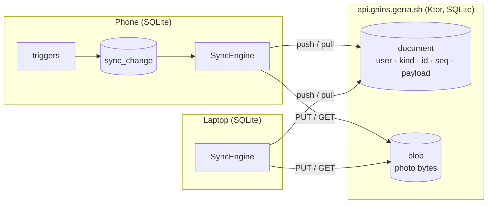

# Accounts and sync

How a workout logged on the phone reaches the laptop, and what the server that carries it knows.
The short version lives in [How it works](how-it-works.md#accounts-and-sync); this page is the design
and the reasons behind it.

- [Shape of it](#shape-of-it)
- [Repository layout](#repository-layout)
- [Signing in](#signing-in)
- [What is synced](#what-is-synced)
- [Documents and the change log](#documents-and-the-change-log)
- [Photos](#photos)
- [The protocol](#the-protocol)
- [What the client does](#what-the-client-does)
- [The server](#the-server)
- [Deploying](#deploying)
- [What is deliberately not here](#what-is-deliberately-not-here)

## Shape of it

The app stays local-first: every screen reads the SQLite database on the device, as it does today,
and a guest never talks to a server. Signing in with Google or Apple adds one thing: a background
worker that pushes what changed here and pulls what changed elsewhere. The server is a per-user
store of small JSON documents plus a per-user store of photo bytes. It never reads inside a
document, never computes an insight and never merges anything finer than a whole document.



## Repository layout

The server is a Gradle module in this repository rather than a repository of its own:

| Path | What it is |
|------|------------|
| [`shared/src/commonMain/kotlin/app/gains/sync/`](../shared/src/commonMain/kotlin/app/gains/sync) | The wire format (`Protocol.kt`, `Documents.kt`), the client engine (`SyncEngine.kt`, `SyncApi.kt`) and the change log it reads (`SyncStore.kt`). Compiled into the app and into the server. |
| [`shared/src/commonMain/sqldelight/app/gains/db/Sync.sq`](../shared/src/commonMain/sqldelight/app/gains/db/Sync.sq) | The `sync_change` and `sync_state` tables and the triggers that fill the first. |
| [`server/`](../server) | The Ktor server: sign-in, the document feed, photo blobs, its own SQLDelight schema. Depends on `:shared`'s JVM target, so the two ends serialize with the same classes. |
| [`deploy/`](../deploy) | The systemd unit, installed by the deploy workflow, and the nginx sites (the API and `gains.gerra.sh`), installed by `tools/deploy_server.py nginx`. |
| [`tools/deploy_server.py`](../tools/deploy_server.py) | Every deploy step as Python, like the release tooling: what the workflow runs, what runs on the box, and the two laptop commands (`secrets`, `nginx`). |
| [`secrets/`](../secrets) | `.env.example` and what each variable is; the real `.env` is never committed and reaches the server only through `tools/deploy_server.py secrets`. |

One pull request changes the app, the server and the format between them, and one CI run checks
all three. The server module also runs inside a desktop test, so
[`SyncRoundTripTest`](../server/src/test/kotlin/app/gains/server/SyncRoundTripTest.kt) syncs two
real client databases through the real routes without a network.

Two things the layout has to respect because of how releases are cut. The
[release branch workflow](../.github/workflows/release-branch.yml) cuts a branch only when
`main` carries a change that reaches the iOS app, so `server/`, `deploy/` and `secrets/`
are on the ignore list in [`tools/release.py`](../tools/release.py): a server change
alone ships no app build. And the deploy workflow watches only the paths the server is built from,
so a UI change does not restart the server.

## Signing in

The mobile flow is not the web flow used by taxes and fintrack. The server sees no redirect, no
OAuth state and no cookie, only an identity token the device already holds:

1. The app asks the platform for an identity token: Sign in with Apple through
   `ASAuthorizationController` on iOS, Google through Credential Manager on Android. Google on
   iOS is an OAuth 2.0 authorization-code flow with PKCE in an `ASWebAuthenticationSession`
   ([`GoogleOAuth`](../shared/src/commonMain/kotlin/app/gains/auth/GoogleOAuth.kt)): the sheet
   shows Google's account chooser, redirects to the iOS client's reversed-id scheme with a code,
   and the app trades the code at Google's token endpoint for an identity token. That is what the
   GoogleSignIn SDK does inside; doing it directly keeps a Swift package and a bridge out of the
   Xcode project and leaves the flow in Kotlin, where CI compiles it and the desktop tests check
   it. The iOS client needs no secret, and its id (`GOOGLE_IOS_CLIENT_ID` in `Config.xcconfig`)
   is the token's audience. The desktop runs the same flow in the person's own browser with a
   **Desktop app** client: the app listens on `127.0.0.1` on a port the OS picks
   ([`LoopbackRedirect`](../shared/src/desktopMain/kotlin/app/gains/auth/LoopbackRedirect.kt)),
   Google redirects there with the code, the tab shows "you can close this tab", and the code is
   traded with the client's secret, which Google documents as not secret for installed apps
   ([`DesktopIdentityProvider`](../composeApp/src/desktopMain/kotlin/app/gains/DesktopIdentityProvider.kt)).
   A closed tab can't be noticed, so the wait ends after five minutes as a cancel.
2. The app posts that token to `POST /auth/google` or `POST /auth/apple`.
3. The server checks the token's signature against the provider's published keys (Google's
   `oauth2/v3/certs`, Apple's `auth/keys`), its issuer, its expiry and that its audience is one
   of our client ids. It then finds or creates the `identity (provider, subject)` row, the `user`
   behind it, and answers with a signed token of its own.
4. Every later request carries `Authorization: Bearer <token>`. Tokens live 30 days;
   `POST /auth/refresh` swaps a valid one for a fresh one, which the client does once a week.

Apple only sends the email and name on the first authorization, so the client passes the name it
was given along with the token and the server keeps it. Accounts are keyed on the provider's
stable subject, never on the email. The same person signing in with both providers gets two
identities on one user when the emails match, ignoring case, and **both** providers say the
address is verified (the token's `email_verified` claim: a boolean from Google, a boolean or the
string `"true"` from Apple). An unverified email is kept on its identity but never joins
anything, in either direction: a verified newcomer doesn't join a user whose only claim to the
address is unverified, and an unverified newcomer gets a user of its own. Each sign-in refreshes
the identity's email and claim, which is how rows from before the claim was stored catch up.

`DELETE /auth/account` removes the user, both identities, every document and every blob, which
Apple requires of any app that offers Sign in with Apple. Settings offers it as "Delete account" on
a signed-in account, behind a confirmation.

Apple also asks that deleting the account revoke the person's Sign in with Apple tokens, which
removes Gains from their Apple ID. Revoking takes a refresh token, and the only way to get one is
to exchange the authorization code the app receives with the identity token, within five minutes
and only once. So an Apple sign-in sends that code along (`SignInRequest.authorizationCode`, from
`ASAuthorizationAppleIDCredential.authorizationCode`; a server from before it skips the field),
and the server trades it at `appleid.apple.com/auth/token`
([`AppleTokens`](../server/src/main/kotlin/app/gains/server/AppleTokens.kt)) for a refresh token,
which it keeps on the `identity` row with the client id it was issued to (the identity token's
audience: the bundle id here, the Services ID for a web flow). Both calls authenticate with a
client secret the server signs itself: an ES256 JWT from the Sign in with Apple key
(`APPLE_KEY_ID`, `APPLE_TEAM_ID`, `APPLE_PRIVATE_KEY`), good for five minutes. The token is kept
only if the `id_token` in Apple's answer has the subject that just signed in, so nobody can pin
someone else's code to their own account. A later Apple sign-in replaces it. A failed exchange is
logged and the sign-in goes ahead.

**Sign in with Apple without Apple's sheet.** Android and the desktop have no native Apple
sign-in, so they use Apple's web flow
([`AppleWebSignIn`](../server/src/main/kotlin/app/gains/server/AppleWebSignIn.kt)). Apple only
redirects to an HTTPS URL registered on the **Services ID** (`APPLE_SERVICES_ID`), so the server
receives the redirect, and the app never sees Apple's tokens:

1. The app opens `GET /auth/apple/start?redirect=<app callback>&state=<app state>` in a browser.
   The callback must be Android's App Link `https://gains.gerra.sh/auth/done` or the desktop's
   loopback `http://127.0.0.1:<port>/…`; anything else is a 400, since the callback receives a
   code that signs someone in. The server remembers the callback and the app's state under a
   state and a nonce of its own (in memory, for ten minutes) and redirects to
   `appleid.apple.com/auth/authorize` with `response_type=code id_token`,
   `response_mode=form_post` (Apple requires it when asking for the name or email),
   `scope=name email` and the Services ID as client id.
2. Apple posts the form to `POST /auth/apple/callback` (`https://api.gains.gerra.sh/…`, or
   `GAINS_PUBLIC_URL`). The server takes the state back, once, and checks the `id_token` like
   `/auth/apple` does, plus two things: its audience is the Services ID, and its `nonce` is the
   one from step 1, so a token from any other sign-in can't be replayed here. The name comes from
   the `user` field Apple posts the first time. It signs the person in, trades the form's `code`
   for a refresh token as above (with the Services ID as client id), and sends the browser to the
   app's callback with `code=<one-time code>&state=<app state>` (a 303). On a closed Apple page
   the callback gets `error=cancelled` instead, and on anything else `error=failed`.
3. The app posts that code to `POST /auth/exchange` and gets the same `{token, user}` as a
   native sign-in. The code works once and for a minute. Our bearer token never goes in a URL,
   where it would stay in the browser's history.

The Apple subject is the same for the bundle id and the Services ID, so an Apple ID signed in on
an iPhone and on Android is one user. Pending sign-ins and codes live in memory, capped at ten
thousand: a restart only loses a sign-in in flight.

On `DELETE /auth/account`, the server posts each stored Apple refresh token to
`appleid.apple.com/auth/revoke` **before** deleting the rows. A failed revoke is logged, and the
deletion goes ahead anyway: Apple being unreachable must never keep anyone's data on our server.
Identities from before this, and servers without the key, have no refresh token, so deleting them
removes our data but can't revoke; the next Apple sign-in stores one. The device keeps its workouts. Only after the server
confirms does it sign out and forget the feed's user and cursor, so a later sign-in, to any
account, uploads everything again. If the call fails, the person stays signed in and can retry.

## What is synced

Everything the person made, nothing the device decided:

| Synced | Kind | Document id | Not synced |
|--------|------|-------------|------------|
| Workouts with their exercises, sets, caption and program link | `session` | the session id | The workout in progress (`live_*` tables) |
| The workout's photo | `session_photo` | the session id | |
| Custom exercises | `exercise` | the exercise id | Built-in exercises (they ship with the app) |
| Import aliases (raw name → exercise) | `alias` | the normalized raw name | |
| Working-set ratio overrides | `override` | the exercise id | |
| Body weight | `bodyweight` | the date | |
| Custom programs with their days and slots | `program` | the program id | Built-in programs |
| Weight unit, bar weight, auto warm-ups, goal profile, active program, onboarding done | `setting` | the setting key | Theme, language, streak reminder, the account itself |

Theme and language are how this device is looked at; the streak reminder is tied to this
device's notification permission. The synced setting keys are listed once, in
[`SyncKinds.settingKeys`](../shared/src/commonMain/kotlin/app/gains/sync/Documents.kt), and the
trigger on the `setting` table names the same keys.

The streak is not stored anywhere, so it needs nothing: it is recomputed from the sessions that
arrive.

## Documents and the change log

A document is one row on the server, keyed by `(user_id, kind, id)`, with a JSON `payload`, the
client's `updated_at`, a `deleted` flag and a server-assigned `seq`. A session with all of its
entries and sets is one document; so is a program with its days and slots. Entry and set rows keep
their autoincrement ids on the device because they never travel on their own.

Editing a session **updates its row**: the push is an upsert, and the primary key is the same
id the editor already keeps stable across edits, including a change of date. Deleting writes the
same row with `deleted = 1` and an empty payload, so the other device learns the session is gone
instead of re-uploading it. There is no history: two devices editing the same session before
either syncs keep the one with the later `updated_at`. For one person on two devices that almost
never happens, and it is the trade-off that keeps the server dumb.

On the device, **what changed is recorded by SQLite triggers**, not by the repositories.
[`Sync.sq`](../shared/src/commonMain/sqldelight/app/gains/db/Sync.sq) has an `AFTER INSERT`, an
`AFTER UPDATE` and an `AFTER DELETE` trigger on every synced table, each writing one row into
`sync_change (kind, id, changed_at, deleted)`. A change to a set marks its session; a change to a
slot marks its program; a change to a built-in exercise or an unsynced setting marks nothing. The
triggers cover every write path there is and every one added later, including
`ExerciseRepository.merge`, which re-points the history of many sessions in one statement.

`changed_at` is the device's clock in UTC. It becomes the document's `updated_at` and decides
last-writer-wins on the server and on the other device. A device with a clock an hour ahead wins
every conflict for an hour; that is accepted.

## Photos

A workout photo is a JPEG of up to a few hundred kilobytes, and base64 inside the JSON feed would
make every pull carry it. So a photo is a document like any other in the feed, `kind =
session_photo`, whose payload is only `{"sha256": …, "size": …}`, and the bytes live in a
separate `blob` table reached by their own routes:

- `PUT /sync/blobs/session_photo/{sessionId}` with the bytes as the body and `X-Updated-At`
  stores the blob and writes the feed document in one transaction.
- `GET /sync/blobs/session_photo/{sessionId}` returns the bytes.
- Removing a photo is an ordinary tombstone in `POST /sync/push`; the server drops the bytes.

A client that pulls a `session_photo` document fetches the bytes right after, one photo at a time.
The feed stays small whatever the history holds.

## The protocol

All bodies are JSON from the `@Serializable` classes in
[`Protocol.kt`](../shared/src/commonMain/kotlin/app/gains/sync/Protocol.kt); the server gzips
responses over a kilobyte.

| Route | Body → answer |
|-------|---------------|
| `GET /health` | `{"status":"ok"}` |
| `POST /auth/google`, `POST /auth/apple` | `{token, name?}` → `{token, user}` |
| `GET /auth/apple/start?redirect=…&state=…` | → 302 to Apple; 400 for a callback that isn't the app's |
| `POST /auth/apple/callback` | Apple's form post → 303 to the app's callback with `code` or `error`, and `state` |
| `POST /auth/exchange` | `{code}` → `{token, user}`; 401 once used or after a minute |
| `POST /auth/refresh` | bearer → `{token, user}` |
| `GET /auth/me` | bearer → `user` |
| `DELETE /auth/account` | bearer → 204, everything gone |
| `POST /sync/push` | `{documents: [{kind, id, updatedAt, deleted, payload}]}` → `{results: [{kind, id, seq, accepted}]}` |
| `GET /sync/pull?since=N&limit=500` | → `{documents: [...with seq], cursor, more}` |
| `PUT /sync/blobs/{kind}/{id}` | bytes + `X-Updated-At` → `{seq}` |
| `GET /sync/blobs/{kind}/{id}` | → bytes |
| `POST /guest-list` | `{email}` → 204 (new or already listed), 400 not an address, 503 list full. No bearer: the form on gains.gerra.sh posts it, not the app |

A push is accepted per document when its `updatedAt` is not older than the row's; a rejected one
is answered with the row's `seq` and `accepted: false`, and the next pull brings the newer version.
Every accepted write takes the next value of a single counter, so `seq` is monotonic for every
user. An overwrite moves the row to the front of the feed: a device that was away for a month sees
each changed document once, in its latest state, and the cost of a pull is bounded by documents,
not by edits.

## What the client does

[`SyncEngine.sync()`](../shared/src/commonMain/kotlin/app/gains/sync/SyncEngine.kt) runs push
then pull:

1. **Push.** Read `sync_change`, load each document from the tables (`SyncStore.load`), post
   them in batches of 200. Photos go through the blob route. A change row is deleted only if its
   `changed_at` is still what was pushed, so an edit made during the push survives to the next one.
2. **Pull.** `GET /sync/pull` from the stored cursor, page by page. Each page is applied in one
   transaction: a document whose local change row is newer is skipped (it will push and win); any
   other is written to the tables through the same row writers the repositories use, its change
   row is deleted inside the same transaction so the apply does not look like an edit, and the
   cursor advances. A crash between pages repeats the page.
3. A client sees its own pushes come back on the next pull, since their `seq` is above its cursor.
   That is harmless: they match what it has, and it does not try to skip them, because another
   device may have written in between.

[`SyncController`](../shared/src/commonMain/kotlin/app/gains/sync/SyncController.kt) decides
when: two seconds after `sync_change` last grew, every time the app comes to the foreground (on
iOS, `UIApplicationWillEnterForegroundNotification` in `MainViewController.kt`), when the person
taps "Sync now" in Settings and right after sign-in. Signing in on a device that already holds guest data marks every local
document as changed and resets the cursor, so the first sync is a union of what is here and what
is there. A guest does that from Settings: the account card offers the enabled providers' buttons
and signs in where the person stands, with no sign-out first, so closing the sheet leaves them a
guest with everything in place.

Settings shows where it stands in the signed-in account card: "Syncing…", "Synced 5 min ago",
with "· 3 changes waiting" while the change log holds something, or that the last run failed.
The engine's status is in memory, so the time of the last successful run is also kept in
`sync_state` (`last_synced_at`) and still shows after a restart; it is cleared when the feed
changes hands. A 401 from the server shows "Signed out on the server" with the provider buttons,
which sign in again where the person stands and then ask for a sync.

The cursor, the user id and when the token was issued live in `sync_state`, inside the app's
database; none of them is a secret. The bearer token goes through a
[`TokenVault`](../shared/src/commonMain/kotlin/app/gains/sync/TokenVault.kt). On iOS that is the
Keychain ([`KeychainTokenVault`](../shared/src/iosMain/kotlin/app/gains/sync/KeychainTokenVault.kt)):
one generic password, service `app.gains.sync`, account `token`, readable after the first unlock
so a background sync works, and "this device only" so it never reaches a backup. A token an
earlier version left in `sync_state` moves into the Keychain the first time it is read, and its
row is deleted. The Keychain outlives the app while the database does not, so at start a token
with no signed-in account in front of it (a reinstall) is cleared.

On Android it is [`KeystoreTokenVault`](../shared/src/androidMain/kotlin/app/gains/sync/KeystoreTokenVault.kt):
an AES-GCM key in the Android Keystore (alias `app.gains.sync.token`, no screen lock needed, so a
background sync works) encrypts the token, and the IV and ciphertext sit in the private
preferences file `app.gains.sync.xml`. That file is excluded from backups and device transfers
(`res/xml/backup_rules.xml`, `data_extraction_rules.xml`), since the key never leaves the phone.
A value the key can't open is dropped and read as no token, so a signed-in account restored
without it sees "Signed out on the server" and signs in again. The same move from `sync_state`
happens on the first read. The key and the file go with the app, so a reinstall starts clean.
The desktop still keeps the token in `sync_state`.

## The server

[`server/`](../server) is Ktor on the CIO engine, a single SQLite file under `GAINS_DATA_DIR`
(WAL mode), SQLDelight for its tables:

```sql
user     (id, email, name, created_at)
identity (provider, subject, user_id, email, email_verified,
          refresh_token, refresh_client_id)                PRIMARY KEY (provider, subject)
document (user_id, kind, id, seq, updated_at, deleted, payload)   PRIMARY KEY (user_id, kind, id)
blob     (user_id, kind, id, bytes)              PRIMARY KEY (user_id, kind, id)
counter  (name, value)                           -- the one seq counter
guest_list (email, created_at)                   PRIMARY KEY (email COLLATE NOCASE), no user
```

Sign-in tokens are RS256 identity tokens checked with `jwks-rsa` against the provider's key set
(cached, rate limited); our own are HS256 with `JWT_SECRET`. The verifier is an interface so the
tests hand the server a key pair of their own and sign real tokens with it.

Configuration is read from the environment, with `secrets/.env` under the working directory
loaded first when it exists (the systemd unit deliberately has no `EnvironmentFile`, for the
reason noted in www's unit): `JWT_SECRET`, `GOOGLE_CLIENT_IDS`, `APPLE_CLIENT_IDS`,
`APPLE_SERVICES_ID`, `APPLE_KEY_ID`, `APPLE_TEAM_ID`, `APPLE_PRIVATE_KEY`, `GAINS_PUBLIC_URL`,
`GAINS_DATA_DIR`, `PORT`. Without a
provider's ids that provider's route answers 503. Without the Apple key, sign-in codes are ignored
and nothing is revoked; the start-up log line says `apple revoke on` or `off`. Without
`APPLE_SERVICES_ID` the web flow's routes answer 503, and the log line says `apple web off`.

## Deploying

The same playbook as taxes and www, on the same Hetzner box:

- Push to `main` touching `server/`, `shared/src/commonMain/`, `deploy/` or the workflow runs
  [`deploy.yml`](../.github/workflows/deploy.yml): `:server:test`, `:server:installDist`, rsync
  of the install directory to `/root/Projects/gains-server/current/`, then
  `tools/deploy_server.py install`, which copies the unit and itself to the box and runs there:
  JDK 17 if the box lacks one, the unit installed, restart, smoke test of `/health`. No shell
  anywhere in it, the same way the release workflows run `tools/release.py`.
- nginx: `deploy/nginx/api.gains.gerra.sh.conf` proxies to `127.0.0.1:5003`.
  `python3 tools/deploy_server.py nginx` pushes every file in `deploy/nginx/` (this one and the
  site's `gains.gerra.sh.conf`), then runs `nginx -t` and reloads. The
  [Deploy site and nginx workflow](../.github/workflows/deploy-site.yml) runs it on a push to
  `main` that touches `deploy/nginx/`. A site whose certificate doesn't exist yet is skipped,
  with the `certbot certonly --nginx -d <name>` line to run on the box first; that is the one
  step left by hand.
- Secrets: `python3 tools/deploy_server.py secrets` copies `secrets/.env` to the box and
  restarts the unit.
- Data: `/var/lib/gains/gains-server.db`, outside the synced tree; back it up by copying the file.
- The host is `api.gains.gerra.sh` rather than `gains.gerra.sh` on purpose: the bare name is the
  app's own site ([`site/`](../site): landing page, `/privacy`, `/support`), which App Store
  Connect needs for the privacy policy and support links, and the API stays on an origin of its
  own. The same workflow rsyncs `site/` to `/var/www/gains.gerra.sh` on a push to `main` that
  touches it, and smoke tests `https://gains.gerra.sh/privacy`.
- Logs: `journalctl -u gains-server`, also on gerra.sh/status.

The workflow needs the repository secrets `DEPLOY_HOST`, `DEPLOY_USER` and `DEPLOY_KEY`, the same
three taxes uses.

## What is deliberately not here

- **Merging inside a document.** Last writer wins per document. A `document_version` table
  written before each overwrite would add undo later without changing the protocol.
- **End-to-end encryption.** Because the payload is opaque to the server, sealing it on the
  device is a client-side change with the same routes, the way fintrack's E2E note describes it.
- **Multi-user features.** One user sees one user's documents. Nothing is shared.
- **Native sign-in buttons beyond iOS.** Sign in with Apple and with Google work on iOS
  (`IosIdentityProvider`, the `com.apple.developer.applesignin` entitlement, and the server URL
  and Google client from `GAINS_SERVER_URL` and `GOOGLE_IOS_CLIENT_ID` in `Config.xcconfig`);
  Apple's audience is the bundle id, Google's the iOS client id. The desktop has Google
  (`DesktopIdentityProvider`, with the server URL and the Desktop app client from the Gradle
  properties `gains.serverUrl`, `gains.googleDesktopClientId` and
  `gains.googleDesktopClientSecret`); its Apple button waits for item 16 of the
  [launch plan](launch-plan.md). Android is next; the server side of Apple's web flow for
  Android and the desktop is in place (above). Until a provider is wired up its button stays
  hidden, or disabled when neither is, and Android keeps `NoIdentityProvider`.
